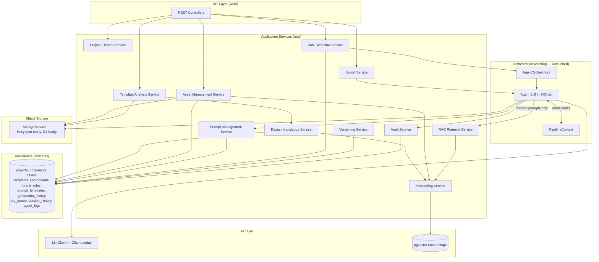
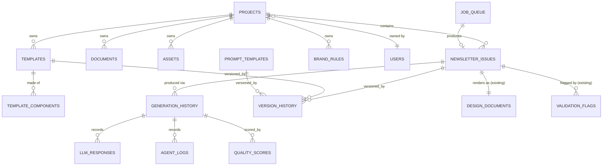
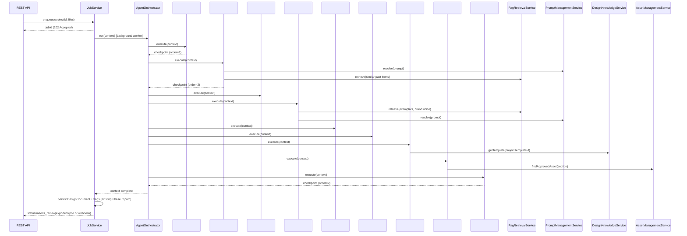
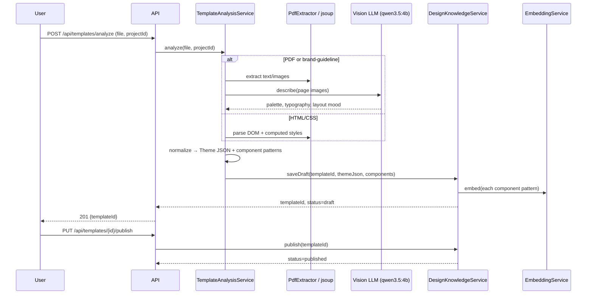
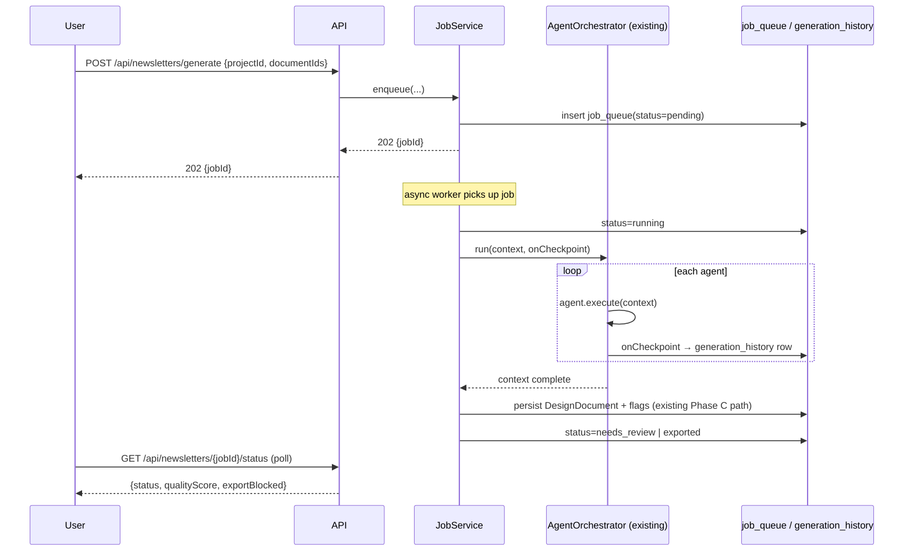
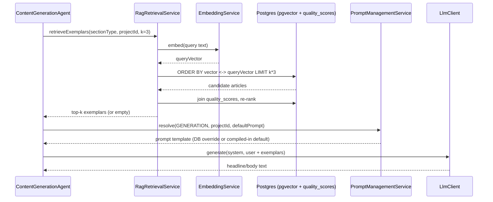

# Backend Architecture — AI Newsletter Generation Platform

> Companion to `TASKS.md` (which tracks day-to-day build status). This document
> is the target-state backend architecture: how the existing 9-agent pipeline
> evolves into a multi-tenant, design-learning platform **without changing the
> orchestration**. Frontend (Angular/React/Thymeleaf) is explicitly out of
> scope — see `TASKS.md` for that.

---

## 0. Guiding principles (why every decision below looks the way it does)

1. **The orchestrator is a closed contract.** `Agent` (`name()` + `execute(PipelineContext)`),
   `AgentOrchestrator` (runs `List<Agent>` in `@Order`), and `PipelineContext`
   (mutable bag agents read/write) are untouched. Every capability below is
   added *around* this contract — new services agents call into, new fields
   agents set on the context — never a new pipeline shape.
2. **Everything new is additive, not a rewrite.** `agent/`, `design/`,
   `document/`, `render/`, `storage/`, `persistence/`, `llm/`, `orchestrator/`,
   `web/` keep their current responsibilities. New packages sit beside them.
3. **The LLM never produces geometry** (locked decision, already true today).
   The Design Learning Pipeline extracts *knowledge* (colors, type scale,
   spacing, component shapes) into the same deterministic `Theme`/
   `DesignTemplate`/`ComponentRole` model `LayoutEngine` already consumes — it
   does not teach the LLM to lay out pages.
4. **Postgres stays the only datastore.** `pgvector` (a Postgres extension)
   covers embeddings — no separate vector DB, no new operational dependency,
   consistent with the project's "everything local, nothing new to run"
   constraint that justified Ollama in the first place.
5. **Don't build for scale you don't have yet.** A real message broker
   (Kafka/RabbitMQ), a separate microservice mesh, and a dedicated vector DB
   are called out explicitly as **not recommended now** — a DB-backed job
   table + `@Async` gets you async execution, checkpointing, and retries today;
   swap the queue implementation later behind the same `JobService` interface
   if throughput ever demands it.
6. **Prompt/versioning/RAG are additive inputs to existing prompts, not a
   replacement.** Every agent's current hardcoded `*Prompts` class (e.g.
   `PlanningPrompts`, `GenerationPrompts`) stays as the compiled-in default.
   New services resolve "is there an active DB-versioned prompt / retrieved
   context for this agent" and fall back to today's behavior when there isn't
   — so this can roll out gradually, agent by agent, with zero downtime risk.

---

## 1. High-level architecture



**Deployment shape:** one Spring Boot modular monolith (not microservices).
At current and near-future scale (tens–low hundreds of concurrent users,
single-tenant-per-deployment or lightly multi-tenant), a monolith with clean
module boundaries is faster to build, easier to keep the "no LLM geometry"
invariant consistent across, and trivially splittable later — every new
module above is defined as a Spring `@Service` behind an interface, so
extracting one into its own deployable is a packaging change, not a redesign.

---

## 2. Package structure

```
com.tcs.contentGenerator
├── agent/                  EXISTING — untouched. ingestion/understanding/planning/
│                           generation/validation/compliance/design/graphics/review
├── design/                 EXISTING — shared Design Model (Theme, ComponentRole, ...)
├── document/               EXISTING — shared ingestion model
├── render/                 EXISTING — html/pptx/pdf renderers + font/ (this session)
├── storage/                EXISTING — StorageService abstraction
├── persistence/            EXISTING — DesignStore, FlagStore + NEW stores below
├── llm/                    EXISTING — LlmClient; EXTEND with embed() (§8)
├── orchestrator/           EXISTING — Agent, AgentOrchestrator, PipelineContext, PipelineService
├── web/                    EXISTING — REST controllers; EXTEND with new resources (§14)
│
├── project/                NEW — Project/Tenant/User ownership
├── job/                    NEW — async job queue, checkpointing, retries
├── knowledge/              NEW — Design Knowledge Service (learned Theme/component data)
├── template/               NEW — Template Analysis Service (ingest → knowledge pipeline)
├── asset/                  NEW — Asset Management Service (catalog over StorageService)
├── prompt/                 NEW — Prompt Management Service (versioned prompt resolution)
├── embedding/              NEW — Embedding Service (thin wrapper over LlmClient.embed + pgvector)
├── rag/                    NEW — RAG Retrieval Service (composes embedding + knowledge + asset)
├── versioning/             NEW — generic version-history support (templates, prompts, designs)
├── audit/                  NEW — per-agent structured audit log
└── security/               NEW/EXTEND — JWT auth, tenant context propagation
```

No existing package is renamed, merged, or split. `agent/*` classes gain new
**constructor dependencies** (e.g. `ContentGenerationAgent` starts taking a
`RagRetrievalService` and `PromptManagementService`) but keep their existing
`execute(PipelineContext)` signature and `@Order` value exactly as-is.

---

## 3. Service layer design — including how every existing agent evolves

Format per agent: **additional responsibilities → new inputs/outputs →
repository access → caching → prompt improvements → model usage → failure
recovery → performance**.

### Agent #1 — Document Ingestion
- **Additional responsibilities:** none to its extraction logic; gains
  **tenant/project scoping** on stored files (`storage/{tenantId}/jobs/{jobId}/...`)
  and an **audit log entry** per document ingested.
- **New inputs:** `projectId` (from `PipelineContext`, set by the new API layer
  before the orchestrator runs).
- **New outputs:** unchanged (`DocumentModel`s) + an `AgentLog` row.
- **Repository access:** `AuditService` (write-only, fire-and-forget).
- **Caching:** none needed (I/O-bound, not repeated).
- **Prompt improvements:** n/a (no LLM call today).
- **Model usage:** unchanged.
- **Failure recovery:** unchanged (per-document isolation already exists);
  now also writes a `FAILED` `AgentLog` row so the Job Service can show *which*
  document failed, not just "ingestion failed."
- **Performance:** unchanged; large uploads should stream to `StorageService`
  rather than buffering fully in memory — flag as a hardening item, not new
  scope here.

### Agent #2 — Content Understanding
- **Additional responsibilities:** none to classification; **embeds** each
  `ContentItem` (title + summary) via the new `EmbeddingService` immediately
  after classification, so later RAG queries ("find similar past content")
  have vectors without a separate backfill job.
- **New inputs:** none required; **optional** `RagRetrievalService` lookup of
  "how was similar content classified/categorized in past issues for this
  tenant" injected into the classification prompt as few-shot examples —
  improves `BusinessCategory` consistency across issues for the same brand.
- **New outputs:** unchanged `ContentItem`s, now embedded into `pgvector`.
- **Repository access:** `EmbeddingService` (write), `RagRetrievalService` (read, optional).
- **Caching:** cache embeddings by content hash (dedup already exists via
  `ContentDeduplicator`; extend its normalized key as the embedding cache key)
  so re-running the same doc doesn't re-embed.
- **Prompt improvements:** `UnderstandingPrompts` becomes the **compiled-in
  default** resolved through `PromptManagementService`; add an optional
  "past examples" section populated by RAG, only when results exist.
- **Model usage:** unchanged chat model; embeddings via `nomic-embed-text`
  (already pulled, per `TASKS.md`).
- **Failure recovery:** unchanged (per-document catch-and-skip); embedding
  failure is logged and skipped, never blocks classification (RAG is
  best-effort everywhere in this design).
- **Performance:** batch embedding calls per document instead of per item
  where the model client supports batching (verify Ollama embeddings endpoint
  batch support before committing to this — flag as a spike).

### Agent #3 — Content Planning
- **Additional responsibilities:** none to scoring logic (stays deterministic
  Java after one LLM scoring call, per existing design).
- **New inputs:** optional RAG context — "how were similar items scored/
  prioritized in past issues" as few-shot examples in the scoring prompt.
- **New outputs:** unchanged `NewsletterPlan`.
- **Repository access:** `RagRetrievalService` (read, optional), `PromptManagementService`.
- **Caching:** none (scoring is issue-specific, not reusable).
- **Prompt improvements:** `PlanningPrompts` becomes DB-overridable via
  `PromptManagementService`, same fallback pattern as Agent #2.
- **Model usage:** unchanged.
- **Failure recovery:** unchanged (neutral score-5 fallback already exists).
- **Performance:** unchanged.

### Agent #4 — Content Generation
- **Additional responsibilities:** this is the **highest-value RAG target** —
  retrieve past well-received articles (see Quality Scores / Agent #9 below)
  for the same section/brand as style exemplars, and retrieve **brand voice
  rules** from `brand_rules` (new table, fed by brand-guideline documents,
  distinct from Agent #6's terminology rules) to steer tone.
- **New inputs:** `RagRetrievalService.retrieve(sectionType, tenantId, k)` →
  ranked past articles + brand voice snippets, injected into the shared
  system prompt alongside the existing house-tone text.
- **New outputs:** unchanged `GeneratedNewsletter`; each `GeneratedArticle`
  gains a `promptVersionId` provenance field (which prompt template/version
  produced it — for audit and quality-score correlation).
- **Repository access:** `RagRetrievalService`, `PromptManagementService`, `AuditService`.
- **Caching:** none (generation is inherently novel per run); the *retrieval*
  step itself should cache embedding-similarity results per (sectionType,
  tenantId) for the lifetime of one pipeline run (multiple articles in the
  same section reuse the same retrieved exemplars).
- **Prompt improvements:** `GenerationPrompts` becomes DB-overridable;
  RAG-retrieved exemplars appended as a labeled "Reference examples" block —
  keep the existing plain-text headline/body protocol unchanged (small-model
  lesson from this codebase: don't add JSON here).
- **Model usage:** unchanged chat model per call; this is the first agent
  worth prioritizing for the planned `qwen2.5:14b`/`qwen3.5:8b` upgrade
  mentioned in `TASKS.md`, since prose quality matters most here.
- **Failure recovery:** unchanged (per-article fallback to extracted title/summary).
- **Performance:** RAG retrieval adds one embedding-similarity query per
  section (not per article) if cached as above — negligible added latency
  next to a ~25s generation call.

### Agent #5 — Fact Validation
- **Additional responsibilities:** none to the validation logic itself
  (deterministic numeric cross-check + LLM claim check stay exactly as-is —
  this agent must **never** consume RAG-retrieved content as ground truth,
  only the actual source document, or it would validate against itself).
- **New inputs/outputs:** unchanged.
- **Repository access:** `AuditService` only (log flags raised, for the audit
  trail requested in Storage §5).
- **Caching:** none.
- **Prompt improvements:** `ValidationPrompts` DB-overridable, same pattern.
- **Model usage:** unchanged.
- **Failure recovery:** unchanged.
- **Performance:** unchanged.

### Agent #6 — Brand Compliance
- **Additional responsibilities:** rulebook currently lives in
  `application.yaml` (`app.compliance.rules`) — **migrate to the new
  `brand_rules` table**, scoped per tenant/project, editable via a REST API
  instead of a redeploy. This is the single most valuable, lowest-risk
  upgrade to this agent (config → data, no logic change).
- **New inputs:** `ComplianceRules` now loaded from `BrandRuleRepository`
  (per tenant) instead of `@ConfigurationProperties`, with the YAML values
  kept as the **seed/default** for tenants with no custom rules yet.
- **New outputs:** unchanged `ComplianceReport`.
- **Repository access:** `AssetManagementService`-adjacent `BrandRuleStore`.
- **Caching:** cache the resolved `ComplianceRules` per tenant for the
  process lifetime (or a short TTL), invalidated on rule edit — rules change
  rarely, this agent runs on every issue.
- **Prompt improvements:** `CompliancePrompts` DB-overridable, same pattern.
- **Model usage:** unchanged.
- **Failure recovery:** unchanged (deterministic-fix-first, LLM-rewrite-second,
  reject-on-invented-numbers already covers this well).
- **Performance:** unchanged; rule lookup is now a cached DB read instead of
  a startup-bound config bean — negligible difference.

### Agent #7 — Design Composition (+ LayoutEngine)
- **Additional responsibilities:** **template selection becomes real** —
  today `DesignCompositionAgent.execute()` calls `templates.getDefault()`
  unconditionally; it should instead resolve `templates.get(project.templateId)`
  where `templateId` may now point at a **learned** template (output of the
  Template Learning Pipeline, §11) with the exact same `DesignTemplate`
  shape as `td-classic`/`tcs-brand` today — **zero change to `LayoutEngine`**,
  which stays 100% deterministic and format-agnostic of where the theme JSON
  came from.
- **New inputs:** `projectId`/`templateId` from `PipelineContext`.
- **New outputs:** unchanged `DesignDocument`; the composition plan gains a
  `templateId` provenance field.
- **Repository access:** `DesignKnowledgeService` (read `DesignTemplate` by id;
  `TemplateCatalog` becomes a thin cache in front of this service instead of
  loading only classpath JSON — see §11).
- **Caching:** `TemplateCatalog` already is an in-memory cache; extend it to
  a proper cache-aside over `DesignKnowledgeService` with invalidation on
  template edit/publish.
- **Prompt improvements:** none — this agent has no LLM call today and stays
  that way (locked decision).
- **Model usage:** none.
- **Failure recovery:** unknown/unpublished `templateId` → fall back to the
  tenant's default template, never fail the run.
- **Performance:** unchanged (rule-based, sub-millisecond).

### Agent #8 — Image & Graphics
- **Additional responsibilities:** `AssetLibrary`'s ad hoc
  `storage/assets/<Section>/` folder convention becomes a real
  **Asset Management Service** query: "approved, brand-tagged image for
  section X, tenant Y, not yet used this run" — same contract
  (`Optional<String> findFor(section)`), new implementation backed by the
  `assets` table instead of `StorageService.list(dir)`.
- **New inputs:** `projectId`/tenant scoping on the asset query.
- **New outputs:** unchanged `GraphicsReport`; `ImagePlacement` gains an
  `assetId` (already close to this via `Asset.id()`) for full provenance.
- **Repository access:** `AssetManagementService`.
- **Caching:** cache "approved assets for section X" per tenant per run
  (already effectively true — `ImagePlacer` is one instance per run).
- **Prompt improvements:** none (no LLM call).
- **Model usage:** none today; **future option** (not required) — use vision
  LLM to auto-tag uploaded assets by subject/mood for better `findFor`
  matching, owned by the Asset Management Service, not this agent.
- **Failure recovery:** unchanged (silently skip if no room/no asset).
- **Performance:** unchanged.

### Agent #9 — Review
- **Additional responsibilities:** persist `qualityScore` (already computed
  deterministically) into a new **`quality_scores`** table, keyed by
  `(projectId, articleId/promptVersionId)` — this is what makes Agent #4's
  "retrieve past well-received articles" RAG use case (above) possible: RAG
  retrieval for exemplars should rank by *this* score, not just recency.
- **New inputs:** none.
- **New outputs:** unchanged `ReviewReport`; a `quality_scores` row per run.
- **Repository access:** `VersioningService`/new `QualityScoreStore`.
- **Caching:** none.
- **Prompt improvements:** `EditorialCheck` prompt DB-overridable, same pattern.
- **Model usage:** unchanged.
- **Failure recovery:** unchanged.
- **Performance:** unchanged.

---

## 4. New backend modules — recommended vs. explicitly not recommended

| Module | Recommend? | Why |
|---|---|---|
| Design Knowledge Service | **Yes** | Formalizes what `TemplateCatalog` already does (load named `Theme`/`DesignTemplate` JSON); makes learned templates first-class alongside hand-authored ones. |
| Template Analysis Service | **Yes** | The actual "Design Learning Pipeline" the brief asks for — net-new capability, no existing analog. |
| Asset Management Service | **Yes** | `AssetLibrary`'s folder convention doesn't scale past a handful of brand assets; this is a data-modeling upgrade, not new architecture. |
| Component Repository | **Yes, folded into Design Knowledge Service** | A "component" here is a named, reusable `(ComponentRole, Frame pattern, TextStyle set)` — the same shape as what's already in `design/`. A separate service would just duplicate `DesignKnowledgeService`'s storage; model it as one more table that service owns (§5 `template_components`). |
| Embedding Service | **Yes** | Thin, single-purpose wrapper needed by RAG, Design Knowledge, and Asset services alike — avoids three services each hand-rolling `pgvector` calls. |
| RAG Service | **Yes** | Genuinely new orchestration logic (rank + assemble context) distinct from raw embedding storage. |
| Vector Search Service | **No — merge into Embedding Service** | A separate "search" service over the same `pgvector` table the Embedding Service owns is a distinction without a difference at this scale; one service, two methods (`embed()`, `search()`). |
| Prompt Management Service | **Yes** | Directly requested, clean single responsibility (version + resolve + fallback), low risk. |
| Export Service | **Yes, thin wrapper** | `RendererRegistry` already *is* this. "Export Service" = `RendererRegistry` + job-queue awareness for async/batch export, not new rendering logic. |
| Project Service | **Yes** | Required for any multi-tenant/multi-user story; nothing like it exists today. |
| Versioning Service | **Yes, generic** | One `version_history` table + service used by templates, prompts, and designs alike (the `DesignRecord`/`DesignStore` optimistic-locking pattern from Phase C is the *design*-specific instance of this general need — generalize the pattern, don't fork it three times). |
| Audit Service | **Yes** | Explicitly requested ("Agent Logs"); simple append-only writer, every agent gets one write, no read-path complexity. |
| Workflow Service | **No — merge into Job Service** | "Workflow" (approval steps, multi-stage sign-off) is a real future need but nothing in the current 9-agent pipeline needs branching workflow *today*; a `job_queue` + status enum covers "async execution + retry + checkpoint" fully. Introduce a real workflow engine only when approval gates are actually scoped. |

---

## 5. Database schema (PostgreSQL + pgvector)

Builds on the existing Phase C tables (`design_documents`, `validation_flags`
— unchanged) and follows their established conventions: UUID/text job ids,
`jsonb` for flexible structured payloads, explicit `revision` columns for
optimistic locking where a row is collaboratively edited.



### `projects`
`id (uuid pk)`, `tenant_id (uuid, indexed)`, `name`, `default_template_id (fk templates)`,
`created_by (fk users)`, `created_at`, `updated_at`.

### `users` *(if not already covered by an existing identity provider)*
`id (uuid pk)`, `tenant_id`, `email (unique per tenant)`, `roles (text[])`,
`created_at`. JWT subject claim maps to `id`; `tenant_id` is the multi-tenant
partition key threaded through **every** table below.

### `documents`
`id (uuid pk)`, `project_id (fk)`, `job_id (text, indexed)`, `filename`,
`document_type`, `stored_ref`, `uploaded_by (fk users)`, `created_at`.
(Mirrors today's in-memory `StoredFile` — this is the durable record of it.)

### `assets`
`id (uuid pk)`, `project_id (fk, nullable for global/library assets)`,
`kind ('image'|'icon'|'illustration'|'logo')`, `section_tag (nullable —
mirrors today's `NewsletterSection` folder convention)`, `stored_ref`,
`mime_type`, `width`, `height`, `brand_approved (bool)`, `tags (text[])`,
`embedding_id (fk embeddings, nullable)`, `created_at`.
Replaces the `storage/assets/<Section>/` folder-as-database convention;
`AssetLibrary.findFor(section)` becomes a query:
`WHERE project_id = ? AND section_tag = ? AND brand_approved ORDER BY ... LIMIT 1`,
falling back to `section_tag IS NULL` (the old `GENERIC/` catch-all).

### `templates`
`id (uuid pk)`, `project_id (fk, nullable for shared/library templates)`,
`name`, `source ('authored'|'learned')`, `theme_json (jsonb — same shape as
today's `Theme` record)`, `status ('draft'|'published')`, `revision (int)`,
`created_at`, `updated_at`. **This is `TemplateCatalog`'s data source once
it stops being classpath-only** — `theme_json` deserializes to the exact
same `Theme` Jackson type already in `design/`.

### `template_components`
`id (uuid pk)`, `template_id (fk, nullable — a component can be
template-agnostic/shared)`, `role (matches `ComponentRole` enum)`,
`pattern_json (jsonb — a `Frame`-shape template + `TextStyle` ref, the
reusable unit `LayoutEngine`'s `placeSectionHeader`/`placeMasthead`-style
methods encode in Java today)`, `source_template_id (fk templates, where it
was learned from)`, `embedding_id (fk embeddings)`, `created_at`.
This is the "Component Repository" from the brief — folded in here per §4.

### `brand_rules`
`id (uuid pk)`, `project_id (fk)`, `rule_type ('terminology'|'proper-name'|
'banned-phrase'|'voice'|'color-usage'|'logo-usage')`, `rule_json (jsonb)`,
`source ('seeded-yaml'|'uploaded-guideline'|'manual')`, `created_at`.
Agent #6's existing YAML rulebook seeds one row set per new project;
`brand-guideline` PDF uploads (Template Analysis Service, §11) can add
`voice`/`color-usage`/`logo-usage` rows the current agent doesn't consume yet
but Agent #4/#7 can once wired.

### `newsletter_issues`
`id (uuid pk)`, `project_id (fk)`, `job_id (text, unique, indexed —
correlates to existing `PipelineContext.jobId`)`, `issue_title`, `status
('queued'|'running'|'needs_review'|'blocked'|'exported')`, `template_id (fk)`,
`created_by (fk users)`, `created_at`, `updated_at`.
This is the durable, queryable header row Phase C's `design_documents` table
never had (that table is keyed by `job_id` alone with no project/user
ownership) — add the FK, don't duplicate the design JSON here.

### `generation_history`
`id (uuid pk)`, `newsletter_issue_id (fk)`, `agent_name`, `started_at`,
`completed_at`, `status ('ok'|'failed'|'degraded')`, `prompt_template_id (fk,
nullable)`. One row per agent execution per run — the backbone the Job
Service uses for checkpointing (§13).

### `llm_responses`
`id (uuid pk)`, `generation_history_id (fk)`, `system_prompt (text)`,
`user_prompt (text)`, `raw_response (text)`, `parsed_ok (bool)`,
`latency_ms (int)`, `model_name`, `created_at`.
Full LLM call audit trail — critical for debugging the small-model quirks
`TASKS.md` already documents extensively (bare-array lists, comma-repair
retries, empty optional fields) and for future prompt-quality analysis.

### `quality_scores`
`id (uuid pk)`, `newsletter_issue_id (fk)`, `component_id (text, matches
`Component.id()`)`, `score (int)`, `findings_json (jsonb — mirrors
`ReviewFinding`)`, `created_at`. Feeds Agent #4's exemplar-retrieval RAG use case.

### `prompt_templates`
`id (uuid pk)`, `project_id (fk, nullable — null = global default)`,
`agent_name`, `prompt_key (e.g. 'system'|'classification'|'scoring')`,
`version (int)`, `body (text)`, `status ('draft'|'active'|'archived')`,
`created_by`, `created_at`. Uniqueness: one `active` row per
`(project_id, agent_name, prompt_key)`.

### `version_history` *(generic)*
`id (uuid pk)`, `entity_type ('template'|'prompt_template'|'design_document')`,
`entity_id (uuid/text)`, `revision (int)`, `snapshot_json (jsonb)`,
`changed_by (fk users)`, `changed_at`. One shared table instead of
per-entity history tables — the `DesignDocument` case can keep using Phase
C's atomic-`UPDATE`-with-`revision` pattern on its own table for the *live*
row and additionally append here on every successful save, giving full
history without touching `DesignStore`'s hot path.

### `agent_logs`
`id (uuid pk)`, `generation_history_id (fk)`, `level ('info'|'warn'|'error')`,
`message`, `context_json (jsonb, nullable)`, `created_at`. Structured
counterpart to today's SLF4J logs — queryable per issue, not just grep-able.

### `job_queue`
`id (uuid pk)`, `job_id (text, unique)`, `newsletter_issue_id (fk, nullable
until the issue row is created)`, `status ('pending'|'running'|'completed'|
'failed'|'cancelled')`, `checkpoint_agent_order (int, nullable — last
successfully completed `@Order` value)`, `retry_count (int)`,
`last_error (text, nullable)`, `enqueued_at`, `started_at`, `completed_at`.

### `embeddings` *(pgvector)*
`id (uuid pk)`, `owner_type ('content_item'|'asset'|'template_component'|
'article')`, `owner_id (text)`, `project_id (fk, nullable)`, `vector
(vector(768) — nomic-embed-text's dimension)`, `model_name`, `created_at`.
One polymorphic table with an HNSW index on `vector`, rather than one table
per owner type — every embedding consumer (`RagRetrievalService`,
`AssetManagementService`, `DesignKnowledgeService`) queries the same table
filtered by `owner_type`/`project_id`.

### `design_metadata`
Deliberately **not** a new table — `DesignDocument.meta()` (`DesignMeta`)
already carries this (`issueTitle`, `jobId`) inside the existing
`design_documents.document` jsonb. Adding a parallel table would duplicate
Phase C's source of truth; extend `DesignMeta` itself if new metadata fields
are needed.

---

## 6. Agent interaction diagram



The orchestrator's internal loop (`for (Agent agent : agents)`) is
**unchanged code** — the "checkpoint" arrows above are `JobService` listening
via a simple `AgentOrchestrator` progress callback (one new, optional
constructor parameter — see §13), not a restructuring of the loop.

---

## 7. Shared context object (`PipelineContext`) evolution

Keep every existing field and getter/setter exactly as-is (this is the
pattern every field already follows: `null` until the owning agent runs).
Add, additively:

- `projectId` / `tenantId` (`String`, set once at context construction by
  `PipelineService`/`JobService` — the only genuinely new *required* field,
  since multi-tenancy is a cross-cutting concern every agent's new service
  calls need).
- `templateId` (`String`, nullable — resolved by the API layer from the
  project's default before the run starts, or explicitly chosen per issue).
- A single `Map<String, Object> ragContextCache` (package-private,
  `RagRetrievalService`-owned) so Agent #4 doesn't re-query per-article
  within one section (§3's Agent #4 caching note) — deliberately a generic
  map, not a growing list of typed fields, since RAG context shapes will
  evolve faster than the rest of the context and don't need to be part of
  the agent contract.

No agent's `execute(PipelineContext)` signature changes. No existing field's
type or semantics changes.

---

## 8. RAG architecture

**Principle: RAG only ever feeds *content/style* prompts (Agents #2, #3, #4,
#6's rewrite path). It never touches Agent #7/`LayoutEngine` — geometry stays
100% deterministic, per the locked architecture decision.**

1. **Embedding generation.** `llm/LlmClient` gains one new method:
   `float[] embed(String text)`, implemented in `SpringAiLlmClient` via
   Spring AI's embedding client against `nomic-embed-text` (already pulled).
   This is the same "provider-agnostic boundary" pattern as `generate()` —
   swapping to a cloud embedding model later is a config change.
2. **Storage.** `EmbeddingService.store(ownerType, ownerId, projectId, vector)`
   writes to the single `embeddings` table (§5). `EmbeddingService.search
   (ownerType, projectId, queryVector, k)` does a `pgvector` cosine-distance
   `ORDER BY ... LIMIT k` query.
3. **Retrieval orchestration.** `RagRetrievalService.retrieveExemplars
   (sectionType, projectId, k)`:
   - embeds a synthetic query (e.g. the section title + key metric),
   - calls `EmbeddingService.search` scoped to `owner_type='article'` and
     `project_id`,
   - joins back to `quality_scores` to **re-rank by past quality score**, not
     just similarity — a mediocre-but-similar article should lose to a
     highly-rated one,
   - returns a small, prompt-ready list of `(headline, body, score)`.
4. **Injection.** `PromptManagementService` (§9) exposes a template
   placeholder (`{{ragExamples}}`) that agents fill from step 3's result
   before calling `LlmClient.generate`. If retrieval returns nothing (new
   tenant, no history yet), the placeholder renders empty — prompts degrade
   gracefully to today's exact behavior.
5. **Tenant isolation.** Every retrieval is `project_id`-scoped by default;
   a project can optionally opt into a "shared library" scope (global,
   `project_id IS NULL` rows) for cross-tenant best-practice examples, but
   never the reverse (one tenant never sees another's content).

---

## 9. Prompt management architecture

- **Storage:** `prompt_templates` (§5), one `active` row per
  `(project_id | null, agent_name, prompt_key)`.
- **Resolution:** `PromptManagementService.resolve(agentName, promptKey,
  projectId, String compiledInDefault)` — checks project-scoped active row,
  then global-scoped active row, then returns `compiledInDefault` (today's
  hardcoded `*Prompts` constant). **Every existing `*Prompts` class becomes
  that default parameter** — a one-line change per call site, no behavior
  change until someone actually publishes a DB prompt.
- **Versioning:** publishing a new prompt version inserts a new row and
  flips `status`; the old row moves to `archived` and is appended to
  `version_history` (generic table, §5) — full rollback capability without
  a bespoke prompt-history table.
- **Testing/rollout:** because resolution is per-agent-per-project, a new
  prompt version can be trialed on one project before becoming the global
  default — no A/B infrastructure needed beyond "some projects have an
  override row, most don't."

---

## 10. Asset management architecture

- **`AssetManagementService`** wraps `StorageService` (bytes, unchanged) with
  the `assets` table (metadata, §5). `AssetLibrary.findFor(section)`'s
  **contract stays identical** — it becomes a thin adapter calling
  `AssetManagementService.findApproved(projectId, sectionTag)` instead of
  `StorageService.list(dir)`, so `ImageGraphicsAgent`/`ImagePlacer` need zero
  changes.
- **Migration path:** a one-time backfill job walks the existing
  `storage/assets/<Section>/*` convention and inserts one `assets` row per
  file (`section_tag` = folder name, `GENERIC` → `section_tag IS NULL`,
  `brand_approved = true`) — the folder convention and the DB catalog are
  briefly dual-read during rollout, then the folder walk is retired.
- **New capability unlocked:** tagging, search, per-tenant scoping, and
  (optionally, later) vision-LLM auto-tagging on upload — none of which the
  folder convention could ever support.
- **Logos/icons/illustration libraries** from the brief are the same table,
  different `kind` values (`'logo'`, `'icon'`, `'illustration'`) — no
  separate service needed, confirming the §4 "no Vector Search Service"
  reasoning: one well-modeled table beats several narrow ones.

---

## 11. Template learning architecture (the Design Learning Pipeline)

This is the newest capability in the whole design — walked through in full
since it's the brief's central ask.

### Ingestion → extraction
- **Input types:** PDF newsletters, HTML+CSS newsletters, brand-guideline
  PDFs, SVG icon/illustration sets.
- **PDF path:** reuse the existing `agent/ingestion/extractor/PdfExtractor`
  for text/image extraction (already built), **plus a new vision-LLM pass**
  (confirmed this session: the locally pulled `qwen3.5:4b` is vision-capable)
  that receives rendered page images and is asked — via a new,
  narrowly-scoped prompt — to describe: color palette (hex-approximate),
  typography mood (serif/sans, size hierarchy), section/layout structure,
  iconography style, spacing rhythm. This is **descriptive extraction**, not
  layout generation — the output is a structured description, still just data.
- **HTML/CSS path:** deterministic parsing (new dependency: `jsoup`, a
  mature, small, pure-Java HTML/CSS parser — no new infra) extracts computed
  styles, DOM section hierarchy, and repeated component shapes directly —
  **cheaper and more reliable than vision for well-formed HTML**, so prefer
  this path whenever the input is HTML rather than a PDF/image render of one.
- **Brand-guideline PDFs:** same `PdfExtractor` + vision pass, prompted
  specifically for color specs, logo usage rules, and typography — feeds
  `brand_rules` (voice/color-usage/logo-usage rows) and can seed a new
  `templates` row's `theme_json` colors/fonts directly (exactly what this
  session's TCS brand template work did **by hand** — this pipeline is that
  same process, automated).

### Normalization
Both paths converge on the **same output shape**: a `Theme`-compatible JSON
(`pageSize`, `colors` role-map, `textStyles` map, `spacing`) plus zero or
more `template_components` rows (`ComponentRole` + a reusable `Frame`
pattern + a `TextStyle` ref) — i.e., the extraction's job is to produce
exactly what `design-templates/*.json` already contains by hand today.
**No new schema is invented for "design knowledge" — it's the existing
`Theme`/`ComponentRole` model, populated by a pipeline instead of a person.**

### Persistence & activation
- `TemplateAnalysisService` writes a `templates` row with `status='draft'`
  and `source='learned'`, plus its `template_components`.
- A human reviews/edits the draft (this is where a future editor UI plugs
  in — out of scope here, but the API contract in §14 supports it) and
  flips `status='published'`.
- Once published, it is **indistinguishable from a hand-authored template**
  to `TemplateCatalog`/`DesignCompositionAgent` — same table, same `Theme`
  shape, same `LayoutEngine` consumption. This is why §3's Agent #7 change
  is so small: the hard problem (learning) is fully isolated in this new
  service; the consumption side already existed.
- Embeddings are generated per `template_component` (its `pattern_json` +
  role, as text) so `RagRetrievalService` can later answer "find a
  component shape similar to X across all learned templates" — supports a
  future "component library browser" without new extraction work.

### Explicitly deferred (not required for this pipeline to be useful)
- Automatic *quality* scoring of learned templates (is this a *good*
  design?) — start with human review via `status='draft'`/`published`, add
  automated scoring later using Agent #9's existing `LayoutLint`-style
  checks run against the learned template's own sample composition.
- Fully automatic HTML→component extraction for arbitrarily messy
  real-world HTML (bad markup, inline-style soup) — ship the CSS/DOM path
  for reasonably well-formed input first, fall back to the vision path
  (screenshot the rendered HTML, treat like a PDF) for anything jsoup can't
  parse cleanly.

---

## 12. Export architecture

No new rendering logic — `RendererRegistry`/`ExportFormat`/`DesignRenderer`
(HTML/PPTX/PDF, all built) already **is** the Export Service. The only
addition: **Export Service = `RendererRegistry` + `JobService` awareness**,
so `POST /export` for a large batch of issues enqueues N jobs instead of
blocking one HTTP request per export, and so `GET /export/{jobId}/status`
exists for polling. Adding a future format (e.g. Word, already noted as
deferred in `TASKS.md`) is exactly what the registry pattern was built for:
a new `DesignRenderer` bean, zero controller changes.

---

## 13. Job processing architecture

- **`job_queue` table (§5) + `JobService`**, not a message broker — matches
  guiding principle #5. `POST /api/newsletters/generate` inserts a `pending`
  row and returns `202 {jobId}` immediately; a Spring `@Async`-annotated
  worker (bounded `ThreadPoolTaskExecutor`, sized to the Ollama instance's
  real concurrency — this is a CPU-bound local LLM per `TASKS.md`'s
  performance notes, so the pool should probably be **small**, e.g. 2-4, not
  "thousands of users" concurrency at the LLM layer regardless of how the
  API layer scales) picks up `pending` rows and calls
  `AgentOrchestrator.run(context)` exactly as `PipelineService` does today.
- **Checkpointing:** `AgentOrchestrator` gains one **optional** constructor
  parameter, a `Consumer<AgentCheckpoint>` (default no-op, so the class's
  existing behavior and existing unit tests are unaffected) invoked after
  each agent completes. `JobService` supplies a consumer that writes a
  `generation_history` row (§5) and bumps `job_queue.checkpoint_agent_order`.
  On worker crash/restart, a job stuck in `running` past a timeout can be
  **resumed from the next `@Order` after the last checkpoint** rather than
  restarted from Agent #1 — valuable given ~90s–10min run times.
- **Retry strategy:** `retry_count`/`last_error` on `job_queue`; a failed
  job auto-retries up to N times with backoff **only if the failure was
  transient** (Ollama timeout, DB connection blip) — a failure inside an
  agent's own per-item error isolation (which already degrades gracefully
  per `TASKS.md`, e.g. one bad article falls back to its source text) should
  **not** trigger a whole-job retry, since the agent already handled it.
  `JobService` distinguishes these by whether `AgentOrchestrator.run` threw
  (retry) vs. completed with a context that has degraded-but-present data
  (don't retry, surface as `needs_review`).
- **Parallel execution opportunities:** the 9-agent chain stays strictly
  sequential (data dependencies are real — #4 needs #3's plan, #7 needs #6's
  corrected text, etc.). The **real** parallelism opportunity is **across
  jobs**, not within one — multiple newsletter issues (different projects or
  different months) run concurrently, bounded by the worker pool size above.
  Within a single agent, #2's per-document classification and #4's
  per-article generation are *already* embarrassingly parallel candidates
  (independent LLM calls) — flag as a targeted optimization inside those two
  agents specifically, not a pipeline-wide change, and only after confirming
  the local Ollama instance can actually serve concurrent requests without
  degrading latency (unverified today — spike before committing).
- **Timeout handling:** per-agent timeout (not just an HTTP client timeout)
  read from `application.yaml`, generous for Agent #2 (chunked understanding
  is the slowest stage per `TASKS.md`'s ~9.5 min/chunk figure on CPU-only
  hardware) and tight for deterministic agents (#7, #9's `LayoutLint` half).
- **Agent communication / error propagation:** unchanged — agents never
  talk to each other directly, only through `PipelineContext`, and an
  uncaught exception from any agent propagates up through
  `AgentOrchestrator.run` exactly as today; `JobService` is the new outer
  catch that marks the job `failed` instead of the HTTP request simply
  erroring.

---

## 14. Sequence diagrams

### 14.1 Template learning (upload → published template)



### 14.2 Newsletter generation (async, existing 9-agent chain)



### 14.3 RAG retrieval inside Agent #4



---

## 15. Implementation roadmap

Builds on `TASKS.md` Phases A–D, already complete (Design Model, PPTX/PDF
renderers, persistence + editor API, Agents #8/#9). Proposed next phases:

### Phase E — Platform foundation (do this first)
`project/`, `security/` (JWT + tenant context propagation), `job/`
(`job_queue` + `JobService` + async worker + checkpointing), `audit/`
(`agent_logs`). **Why first:** every other new module is meaningless without
tenant scoping (RAG/assets/prompts all key on `project_id`), and moving
generation off the request thread is required before load-testing anything
else — building Asset/Prompt/RAG services on top of a still-synchronous,
single-tenant pipeline would mean redoing their call sites once this lands.

### Phase F — Asset Management Service
Formalize `AssetLibrary` into `assets` table + service, backfill existing
`storage/assets/*` folders. **Why second:** low risk (pure data-modeling
over an already-abstracted `StorageService`), immediately useful on its own,
and a **prerequisite** for Template Learning (Phase I) which needs a real
place to store extracted icons/illustrations, not another folder convention.

### Phase G — Prompt Management Service
`prompt_templates` table + `PromptManagementService`, wired as the resolution
layer in front of every existing `*Prompts` class (default-fallback pattern,
§9). **Why third:** self-contained, zero risk to existing behavior until a
prompt is actually published, and it's the mechanism RAG-retrieved context
(Phase H) needs to actually reach a prompt — build the pipe before the water.

### Phase H — Embedding Service + RAG Retrieval Service
`embeddings` table (pgvector), `LlmClient.embed()`, `EmbeddingService`,
`RagRetrievalService`; wire into Agent #2 (embed on ingest) and Agent #4
(exemplar retrieval) first — these are pure-text LLM calls already, the
lowest-risk place to prove RAG value before touching anything vision-related.
**Why fourth:** needs Phase G (prompt injection point) and Phase E (tenant
scoping) already in place; deliberately *after* Asset Management so the
polymorphic `embeddings` table's `owner_type='asset'` rows have somewhere
real to point at from day one.

### Phase I — Template Learning Pipeline (Design Knowledge + Template Analysis)
The novel, highest-uncertainty piece — extraction quality from vision LLM
calls on real-world PDFs is genuinely unproven at this point (unlike
everything above, which is mostly "known engineering"). **Why last:** it's
built entirely on infrastructure from Phases E–H (project scoping, asset
storage, embeddings, and prompt versioning for the extraction prompts
themselves); doing it first would mean re-plumbing all of that in afterward.
Start narrow: HTML/CSS path only (jsoup, deterministic, no vision-quality
risk) producing `templates`/`template_components` rows and wiring
`DesignCompositionAgent` to consume a learned template — prove the
*consumption* side end-to-end on the easy input type before investing in the
harder PDF/vision extraction path.

### Phase J — Editor-facing API surface
Extend the existing Design API (Phase C) with template/component/asset
browsing endpoints for the future Angular/React editor (§16 below has the
contracts) — deliberately last since it's pure surface area over
capabilities Phases E–I already built; no new backend logic, just controllers.

**One-line priority summary:** *tenant + async job plumbing, then assets,
then prompts, then embeddings/RAG, then template learning, then editor APIs*
— each phase is a hard prerequisite for the next, and every phase leaves the
existing 9-agent orchestration compiling and passing its current tests
unchanged.

---

## 16. REST API contracts (no controller code — shapes only)

All routes below assume an existing `Authorization: Bearer <jwt>` and
resolve `projectId`/`tenantId` from the token or an explicit path segment;
omitted here for brevity.

```
# Documents & generation (extends existing IngestionController/DesignApiController)
POST   /api/projects/{projectId}/documents              multipart upload → {documentId}
POST   /api/projects/{projectId}/newsletters/generate    {documentIds[]} → 202 {jobId}
GET    /api/jobs/{jobId}                                  → {status, checkpointAgentOrder, error?}
GET    /api/newsletters/{jobId}                           existing GET /api/designs/{jobId}, unchanged
PUT    /api/newsletters/{jobId}                           existing PUT /api/designs/{jobId}, unchanged
GET    /api/newsletters/{jobId}/flags                     existing, unchanged
POST   /api/newsletters/{jobId}/flags/{flagId}/resolve    existing, unchanged
GET    /api/newsletters/{jobId}/export?format=            existing, now also POST /api/newsletters/{jobId}/export/batch for multiple formats → {exportJobId}
GET    /api/exports/{exportJobId}                         → {status, downloadUrl?}

# Template learning (new)
POST   /api/projects/{projectId}/templates/analyze        multipart (pdf/html/css) → {templateId, status:draft}
GET    /api/projects/{projectId}/templates                → [{id, name, source, status}]
GET    /api/templates/{templateId}                        → full Theme + components (editor-consumable)
PUT    /api/templates/{templateId}                        edit draft → new revision
POST   /api/templates/{templateId}/publish                draft → published
POST   /api/projects/{projectId}/newsletters/{jobId}/template  {templateId} → assign for next generation

# Components (folded into Design Knowledge Service, §4)
GET    /api/templates/{templateId}/components             → [{id, role, patternJson}]
GET    /api/components/search?role=&query=                RAG-backed similarity search across all templates

# Brand rules
GET    /api/projects/{projectId}/brand-rules
PUT    /api/projects/{projectId}/brand-rules               bulk replace (terminology/proper-name/banned-phrase/voice/color-usage/logo-usage)
POST   /api/projects/{projectId}/brand-rules/from-guideline  multipart PDF → extracted draft rules for review

# Assets
POST   /api/projects/{projectId}/assets                    multipart + {kind, sectionTag?, tags[]}
GET    /api/projects/{projectId}/assets?kind=&sectionTag=&tag=
PATCH  /api/assets/{assetId}                                update tags/brand_approved

# Prompts
GET    /api/projects/{projectId}/prompts?agentName=
PUT    /api/projects/{projectId}/prompts/{agentName}/{promptKey}   new version → draft
POST   /api/prompts/{promptTemplateId}/activate

# Projects (multi-tenant/multi-user)
POST   /api/projects                                        {name, defaultTemplateId?}
GET    /api/projects
GET    /api/projects/{projectId}
```

Batch generation is `POST .../generate` called N times (or a
`{documentIds[][]}` bulk variant returning `{jobIds[]}`) — no special batch
infrastructure beyond the job queue already handling concurrency.

---

## Summary

Nothing above changes `Agent`, `AgentOrchestrator`, `PipelineContext`'s
existing fields, or any of the 9 agents' `execute()` signatures. Every new
capability — multi-tenancy, async jobs, asset catalog, versioned prompts,
RAG, and design-system learning — is a new service the existing agents
optionally call into, storing data in new Postgres tables (plus `pgvector`
for embeddings, no new datastore), with the Template Learning Pipeline's
entire output landing in the *same* `Theme`/`ComponentRole` shape
`LayoutEngine` already renders deterministically today.
