# TASKS — AI-Powered Multi-Agent TD Monthly Newsletter Generator

> Living task file. Check items off as they land. Phases are ordered so each one
> produces something runnable. Brainstorm notes / open questions are at the bottom.
>
> **Target-state backend architecture (multi-tenant, design-learning platform,
> built on top of everything below without changing the orchestration) lives in
> `ARCHITECTURE.md` — read that before starting Phase E onward.**

## Project Context

- **Stack:** Spring Boot 4.1.0, Java 21, Maven
- **Persistence:** Spring Data JPA + PostgreSQL
- **Security:** Spring Security (starter present, not yet configured)
- **Utilities:** Lombok
- **AI layer:** **Ollama (local, free, offline)** via Spring AI — no API key, no
  data leaves the machine (solves corporate data-sensitivity concerns).
  - Installed: Ollama `0.30.11`.
  - Chat model available: `qwen3.5:4b` (small — fine for prototype; consider a
    larger model, e.g. `qwen2.5:14b` / `llama3.1:8b`, for Content Understanding,
    Fact Validation, and Review once the pipeline works).
  - Embedding model available: `nomic-embed-text` (use for de-duplication,
    classification by similarity, and provenance/fact-check retrieval).
  - Keep all model calls behind a provider-agnostic interface so a cloud model
    (Anthropic/Gemini/etc.) can be swapped in later via config only.
- **Group / base package:** `com.tcs.contentGenerator`

The system turns uploaded business documents (Excel, Word, PDF, PowerPoint)
into a professionally designed monthly newsletter via a pipeline of specialized
agents coordinated by an orchestrator.

**Deliverable (decided 2026-07-04): an *editable* newsletter, not email HTML.**
The pipeline produces a renderer-independent **Design Model** (JSON design
tree — pages, positioned text/image/shape components, theme). That model is
the single source of truth: a future Angular visual editor (Canva /
PowerPoint-Online-style) loads and edits it, and dedicated renderer classes
export it as **PPTX, PDF, and HTML**. See "Design Model architecture" before
§3.7.

---

## Current State (handoff — read this first)

**Done & verified:** Agent #1 (Document Ingestion) is built, compiles, boots
against local Postgres, and is smoke-tested live. `POST /api/ingest` (multipart,
field `files`) accepts xlsx/docx/pdf/pptx, extracts them into the shared
`document/` model, stores originals + images under `storage/jobs/{jobId}/...`,
and returns a per-document block-count summary.

Agent #2 (Content Understanding) is built, compiles, and is **verified live
end-to-end** through the real Spring app (booted on port 8091 against local
Postgres + Ollama): `POST /api/ingest` on a sample `.docx` returned a correctly
classified `contentItems` array (title, category, type, metrics, provenance) —
not just a direct Ollama probe. Also verified via the temporary Thymeleaf UI
(`GET /` upload form → `POST /run` → `result.html` shows both agents' output).

Agent #3 (Content Planning) is built, compiles, and is **verified live e2e**
(booted on port 8091, Postgres + Ollama): `POST /api/ingest` on the sample
`.docx` returned a `plan` block — issue title "TD Monthly Newsletter — July
2026", a Leadership Message placeholder section, and Delivery Highlights with
the item scored 9/10 plus rationale. Also verified through the web UI
(`POST /run` → result page renders the plan) and the error page renders for
`Accept: text/html`.

**Agent #3 facts:**
- Package `agent/planning/`: `ContentPlanningAgent` (`@Order(3)`),
  `NewsletterSection` enum (declaration order = final reading order; maps 1:1
  from `BusinessCategory`; `LEADERSHIP_MESSAGE` has no source category and is
  planned with an empty item list for the generation agent to write;
  `IN_OTHER_NEWS` catches `OTHER`), `PlannedItem` (item + score 1–10 +
  rationale), `SectionPlan`, `NewsletterPlan` (issueTitle, sections in order,
  deferredItems), `ScoredItem` (LLM DTO — bare array, per the extractJson
  lesson), `PlanningPrompts`.
- Design: **one LLM call scores all items** (numbered list in, `ScoredItem[]`
  out, matched back by index, clamped 1–10); selection/ordering is
  **deterministic Java** — score < `app.planning.min-score` (default 4) →
  deferred; per-section cap `app.planning.max-items-per-section` (default 5),
  overflow deferred; sections emitted in `NewsletterSection` enum order. If the
  scoring call fails entirely, every item gets a neutral score 5 so the run
  still produces a plan.
- `PipelineContext` now carries `NewsletterPlan` (get/setNewsletterPlan; null
  until agent #3 runs). `IngestionResponse` gained a `plan` field
  (PlanSummary → SectionSummary/PlannedItemSummary).
- Note: the small model sometimes returns an empty `rationale` — handled
  (nulls stripped to ""), don't rely on it downstream.

Agent #4 (Content Generation) is built, compiles, and is **verified live e2e**
(booted on port 8091, Postgres + Ollama): `POST /api/ingest` on the small sample
`.docx` returned a `newsletter` block — Leadership Message written from an issue
digest (3 paragraphs, fallback headline) and a Delivery Highlights article with
a fresh headline, the NPS 72 metric woven into the prose, and `sourceTitle`
provenance back to the planned item.

**Agent #4 facts:**
- Package `agent/generation/`: `ContentGenerationAgent` (`@Order(4)`),
  `GeneratedNewsletter` (issueTitle + sections, `articleCount()`),
  `GeneratedSection`, `GeneratedArticle` (headline, body, `source` PlannedItem —
  null only for the Leadership Message), `GenerationPrompts`.
- Design: **one LLM call per planned item** plus one for the Leadership Message
  (written from a digest of section titles + top story titles, since it has no
  source items). A single shared system prompt carries the house tone.
- **Output protocol is plain text, not JSON** — "line 1 = headline, blank line,
  body paragraphs". Long prose inside JSON strings is where this small model
  reliably breaks (unescaped newlines), so generation avoids JSON entirely.
  `parse()` tolerates markdown fences, "Headline:" prefixes, quotes/`#`
  decoration, and — observed live — the model skipping the headline and opening
  with prose: a first line > 120 chars is reclaimed as body and the fallback
  headline (item title / "A Message from Leadership") takes over.
- Failure isolation per article: a failed call falls back to the item's
  extracted title + summary, so one bad generation degrades one article, never
  the issue. Bodies are plain paragraphs; `result.html` renders them with
  `white-space: pre-line` (`.article-body`).
- `PipelineContext` now carries `GeneratedNewsletter` (get/setGeneratedNewsletter;
  null until agent #4 runs). `IngestionResponse` gained a `newsletter` field
  (NewsletterSummary → GeneratedSectionSummary/ArticleSummary).

Agent #5 (Fact Validation) is built, compiles, and is **verified live e2e**
(booted on port 8091, Postgres + Ollama): `POST /api/ingest` on the small sample
`.docx` returned a `validation` block — 1 article fact-checked, 1 skipped (the
Leadership Message, no source by design), and on one run the checker caught a
genuinely hallucinated claim ("We are already preparing updates based on their
feedback" — HIGH severity, nothing in the source says that) which correctly
flipped `exportBlocked: true`. The web UI (`POST /run`) renders the Agent #5
stage with the export-gate banner (a second run produced zero flags → "clear
for export" branch verified too; flag output varies run to run, small model).

**Agent #5 facts:**
- Package `agent/validation/`: `FactValidationAgent` (`@Order(5)`),
  `ValidationSeverity` (LOW→MEDIUM→HIGH, lenient `fromLabel` falls back to
  MEDIUM, `meetsOrExceeds` for the gate), `ValidationFlag` (section + article
  headline + claim + severity + issue), `ValidationReport` (flags, checked,
  skipped, exportBlocked), `ClaimFlag` (LLM DTO — bare array, per the
  extractJson lesson), `ValidationPrompts`, `SourceTextResolver`.
- Provenance resolution: `ContentItem.sources()` refs are **document/chunk
  level**, not block level — the understanding agent stamps
  `SourceRef(filename, "document" | "chunk i/n", itemCounter)`. So
  `SourceTextResolver` finds the `DocumentModel` by filename and **re-chunks it
  with the same deterministic `DocumentChunker`** to return exactly the chunk
  the item came from, capped at `app.validation.max-source-chars` (default
  6000 — keeps source + article inside `num-ctx: 8192`).
- Two independent checks per article: (1) a **deterministic numeric
  cross-check** (regex `\d[\d,]*(\.\d+)?`, comma-stripped token + substring
  match against source + item title/summary/metrics + issue title; misses →
  MEDIUM, no LLM cost); (2) **one LLM call per article** returning a bare
  `ClaimFlag[]` (empty array = all supported), severities parsed leniently.
- Deterministic Java gate: `exportBlocked` = any flag `meetsOrExceeds`
  `app.validation.blocking-severity` (default `high`).
- Failure isolation: LLM-call failure or unresolvable source → one LOW flag on
  that article, run continues. Leadership Message skipped (source == null).
- `PipelineContext` carries `ValidationReport`; `IngestionResponse` gained a
  `validation` field (ValidationSummary → FlagSummary). `result.html` renders
  the gate banner (`.gate.ok`/`.gate.blocked`) + flags table with severity
  chips (`.sev.high/.medium/.low` in `app.css`).
- Observed live: the small model's flags lean verbose/over-cautious (it flags
  interpretive framing as MEDIUM); severities other than HIGH don't block, so
  this is noise, not a gate problem. Tune `ValidationPrompts.SYSTEM` if it gets
  worse.

Agent #6 (Brand Compliance) is built, compiles, has **unit tests** (the first
in the repo — `BrandComplianceAgentTest`, 6 tests, LLM stubbed, all green via
`./mvnw test -Dtest=BrandComplianceAgentTest`), and is **verified live e2e**
(booted on port 8091, Postgres + Ollama): a clean run returned
`compliance: {articlesChecked: 2, violations: []}`; a second run with a
casing rule injected via `SPRING_APPLICATION_JSON` (canonical `APOLLO`) caught
"Apollo" in both articles, auto-fixed them (`articlesFixed: 2`, headline and
body now say APOLLO), and the web UI rendered the Agent #6 stage with the
violations table and "✓ fixed" chips.

**Agent #6 facts:**
- Package `agent/compliance/`: `BrandComplianceAgent` (`@Order(6)`),
  `ComplianceRules` (`@ConfigurationProperties("app.compliance.rules")` record
  — the app class now has `@ConfigurationPropertiesScan`), `ViolationType`
  (TERMINOLOGY / CASING / BANNED_PHRASE), `ComplianceViolation`,
  `ComplianceReport` (violations + articlesChecked/articlesFixed +
  `unresolvedCount()`), `CompliancePrompts`.
- The rulebook lives in `application.yaml` under `app.compliance.rules`:
  `terminology` (banned term → replacement; **map keys use `"[bracket]"`
  notation** or Spring's relaxed binding strips spaces from keys like
  `"in order to"`), `proper-names` (canonical casing), `banned-phrases`
  (buzzwords with no drop-in replacement).
- Fix strategy, cheapest first: (1) terminology → deterministic case-preserving
  substitution (ALL-CAPS match → ALL-CAPS replacement, Capitalized →
  Capitalized); (2) casing → deterministic correction to canonical; (3) banned
  phrases → **one LLM rewrite call per affected article** (plain-text
  headline/body protocol, same as generation), accepted only if the banned
  wording is actually gone, the body survived parsing, AND the rewrite's
  number tokens ⊆ the original's (fact validation already ran — a rewrite must
  not invent figures behind its back). Rejected/failed rewrite → article keeps
  its deterministically-fixed text, violation reported `fixed: false` ("needs
  editor" in the UI). All matching is whole-word regex, patterns compiled once
  in the constructor.
- The agent **replaces** the `GeneratedNewsletter` on the context with the
  corrected articles (so the Agent #4 stage in `result.html` shows post-fix
  text); the `ComplianceReport` is the record of what changed. No export gate
  — breaches are editorial, not factual.
- `PipelineContext` carries `ComplianceReport`; `IngestionResponse` gained a
  `compliance` field (ComplianceSummary → ViolationSummary). `result.html`
  renders the stage (stats line + violations table with `.fix.ok`/`.fix.pending`
  chips in `app.css`); `index.html` lists agent #6.
- Live-test trick: rules are config, so a guaranteed-hit rule can be injected
  without code changes via `SPRING_APPLICATION_JSON` (note:
  `-Dspring-boot.run.arguments=--a,--b` comma-splitting did NOT work with this
  plugin version — the whole string landed in the first property).

**Thymeleaf is now properly integrated (no longer "temporary"):**
- Shared fragments in `templates/fragments/page.html` (`head(title)` fragment +
  `back` link); all styling moved to `static/css/app.css`; `templates/error.html`
  replaces the whitelabel error page (`server.error.include-message: always`
  set for dev). `result.html` shows all agents' output; `index.html` lists the
  agent chain. Thymeleaf serves the **dev web UI only** — the newsletter itself
  is produced by the Design Model + renderers (see §3.7+), not by Thymeleaf
  templates (the pom comment saying otherwise predates this decision).

**AI layer facts:**
- Provider-agnostic LLM boundary lives in `llm/`: `LlmClient` interface
  (`generate(system,user)` + `generate(system,user,Class<T>)` structured) and
  `SpringAiLlmClient` (wraps Spring AI `ChatClient`; injects the autoconfigured
  `ChatModel`). Agents depend only on `LlmClient` — swap providers via config.
- Spring AI **2.0.0** (BOM import in `pom.xml`, aligns with Boot 4.x);
  `spring-ai-starter-model-ollama`. Config in `application.yaml` under `spring.ai.ollama`
  (base-url, chat model `qwen3.5:4b`, embed model `nomic-embed-text`,
  `init.pull-model-strategy: never`).
- **`spring.ai.ollama.chat.think: false`** — qwen3.5 is a reasoning model;
  thinking + JSON was ~6x slower (148s vs 24s/doc) with no quality gain. This
  property is the only clean lever (`OllamaOptions` has no `think` setter).
  Verified binding live: warm calls now complete in ~30s.
- **Structured output cannot rely on Spring AI's `.entity()`/`BeanOutputConverter`
  cleanup alone** — this local model does not reliably return clean JSON. Observed
  live: (a) a bare JSON array instead of the requested wrapper object → target
  type changed to `ExtractedItem[]`; (b) the raw completion sometimes contains
  *two* JSON payloads back-to-back (one bare, one re-stated inside a ```json
  fence) → a naive "first `[` to last `]`" span swallows the fence in between and
  breaks parsing. Fixed in `SpringAiLlmClient.extractJson` with a string-aware
  bracket-depth scanner that returns only the *first complete* JSON value and
  ignores anything after it. This lives in the provider wrapper, so every
  structured-output agent benefits, not just Agent #2.
- `PipelineContext` carries `List<ContentItem>` (add/get). `POST /api/ingest`
  runs the whole chain; the response includes `contentItems` and `plan`.
- **Web UI:** `PipelineService` (in `orchestrator/`) is the shared store-and-run
  path used by both `IngestionController` (JSON API) and `PipelineViewController`
  (`web/`) + `templates/index.html` (upload form) / `templates/result.html`
  (all agents' output). `spring-boot-starter-thymeleaf` in `pom.xml`.

**Key facts for continuing:**
- App runs on a user-managed instance (port 8090 in last session). Local Postgres
  DB `contentgenerator`, user `postgres`, password `root` (env-overridable:
  `DB_URL`/`DB_USERNAME`/`DB_PASSWORD`). Build: `./mvnw compile`.
- Pipeline contract lives in `orchestrator/`: `Agent` interface
  (`name()` + `execute(PipelineContext)`), `AgentOrchestrator` (runs all `Agent`
  beans by `@Order`), `PipelineContext` (holds `jobId`, input files, and the
  `List<DocumentModel>` produced by ingestion — later agents append their output).
- Shared model in `document/`: `DocumentModel` = metadata + `List<DocumentBlock>`;
  `DocumentBlock` sealed → `HeadingBlock | TextBlock | TableBlock | ImageBlock`,
  each with a `SourceRef` (doc + sheet/page/slide + ordinal) for provenance.
- **Each agent = its own package** under `agent/`. Ingestion is `agent/ingestion/`.
- **AI not wired yet** — Spring AI + Ollama starter still needs adding (Phase 0).

**Not done:** Agents #1–#5 automated unit tests (#6/#7/#8/#9/renderers/stores
have them). (DB persistence of the design + flags and the flag-resolution
endpoint landed with Phase C — see below; intermediate agent outputs other
than flags are still in-memory/response-only by design.)

**Performance note (observed live):** with `num-ctx: 8192` and chunking, a large
docx (93 blocks → 2 chunks) took ~9.5 min *per understanding chunk* on this
CPU-only machine — decode of a 20-item JSON array dominates. The small sample
docx runs the whole 4-agent pipeline in ~90s. Generation calls are short
(~150-word outputs, ~25s each). Budget accordingly when testing with the big
`samples/TD_Monthly_SourcePack_June2026.docx`.

Agent #7 (Design Composition) is built, compiles, has **unit tests** (Jackson
round-trip on the shared `design/` model + `LayoutEngineTest`'s layout
invariants — no overlaps, frames inside margins, all articles placed,
pagination fires — 5 tests total, all green), and is **verified live e2e**
(booted on port 8090, Postgres + Ollama): `POST /api/ingest` on the sample
`.docx` returned `design: {pageCount: 1, componentCount: 12}` — a HERO
Leadership Message plus a STAT_CALLOUT Delivery Highlights article (the
`NPS:72` key metric correctly triggered the stat pattern, showing "72" /
"NPS:72" side by side). The web UI (`POST /run`) embeds the rendered HTML
live via an `<iframe srcdoc>` in the Agent #7 stage — Phase A's exit
criterion (the design visible end-to-end) is met.

**Agent #7 facts:**
- Shared **`design/`** package (peer of `document/`): sealed `Component`
  (`TextBox | ImageBox | ShapeBox`, `@JsonTypeInfo(use = DEDUCTION)` so the
  JSON round-trips without a synthetic type field — Jackson infers the
  subtype from each record's distinct field set), `Frame`, `ComponentRole`,
  `SourceLink` (section title + article headline — the same natural-key
  provenance pattern validation/compliance already use, not a synthetic id),
  `TextStyle`, `PageSize`, `Spacing`, `Theme`, `Asset`, `Page`, `DesignMeta`,
  `DesignDocument` (schemaVersion, revision, meta, theme, assets, pages).
- Package `agent/design/`: `DesignCompositionAgent` (`@Order(7)`) —
  **pattern selection is rule-based, not an LLM call** (no cost at this
  stage): `LEADERSHIP_MESSAGE`→HERO, `UPCOMING_EVENTS`→EVENT_LIST, a single
  article with a numeric key metric→STAT_CALLOUT (value/label pulled via the
  same numeric regex fact-validation uses), exactly 2 articles→TWO_COLUMN,
  else STANDARD. `IconMatcher` deterministically maps each `NewsletterSection`
  to a theme color role (a colored dot stands in for real iconography until
  Agent #8 sources actual images). `TemplateCatalog` loads
  `DesignTemplate` (name + `Theme`) from
  `resources/design-templates/td-classic.json` (A4 portrait, one template).
  `CompositionPlan`/`SectionComposition` carry the semantic plan — **no
  coordinates yet**.
- Package `agent/design/layout/`: `LayoutEngine` (100% deterministic, no LLM)
  turns the `CompositionPlan` into positioned pages — one method per pattern,
  measuring text via `TextMeasurer` (AWT `FontMetrics` against a scratch
  `Graphics2D`, estimate only, every renderer wraps natively at render time)
  and tracking the cursor via `Paginator` (starts a new page when a component
  doesn't fit; `OverflowResolver` clamps a component's height to what a whole
  page could ever hold when it's bigger than that — logged, and by design the
  clamped component still visually overflows its frame until a human edits it
  in the future editor — an accepted v1 trade-off, not a bug).
- **Render `render/`**: `DesignRenderer` interface + `RendererRegistry`
  (same registry-over-a-list pattern as `ExtractorRegistry`) + `ExportFormat`
  (HTML implemented; PPTX/PDF are enum values only, Phase B). `render/html/HtmlDesignRenderer`
  emits a standalone HTML doc — one `div.page` per page, `pt`-unit
  absolutely-positioned `div.cmp` children (CSS `pt` *is* our model's unit,
  no conversion needed), theme colors/styles inlined. Deliberately
  print/preview-style, not responsive — this is not the editor.
- `PipelineContext` carries `DesignDocument` (get/setDesignDocument; null
  until agent #7 runs). `IngestionResponse` gained a `design` field
  (`DesignSummary(pageCount, componentCount)`). The web UI doesn't put the
  raw HTML through `IngestionResponse` (JSON API callers don't need a
  megabyte of markup) — `PipelineViewController` renders it separately via
  `HtmlDesignRenderer` into a `designHtml` model attribute, embedded through
  `<iframe th:attr="srcdoc=${designHtml}">` (Thymeleaf HTML-escapes the
  attribute value by default, which is exactly what a `srcdoc` needs).
- **Gotcha for future Jackson use anywhere in this repo:** this project is on
  **Jackson 3.x** (Spring Boot 4.1 pulls `tools.jackson.core:jackson-databind`,
  *not* `com.fasterxml.jackson.databind`) — the base package renamed from
  `com.fasterxml.jackson.*` to `tools.jackson.*` (annotations stayed at
  `com.fasterxml.jackson.annotation`, only core/databind moved). Import
  `tools.jackson.databind.ObjectMapper` / `tools.jackson.databind.json.JsonMapper`,
  not the 2.x package — the 2.x import compiles as a phantom-looking IDE
  error but is really just the wrong artifact.

**Phase B PPTX renderer DONE (2026-07-05):** `render/pptx/PptxDesignRenderer`
(POI XSLF) is built, unit-tested, and **verified live e2e** (booted on port
8090, Postgres + Ollama): `POST /run` on the sample docx → `GET
/design/{jobId}/export.pptx` downloaded a real `.pptx` (confirmed via `file`
and by parsing it back with POI) — 1 slide, page size 595×842pt matching the
theme, all 12 components present with correct text and positions, including
the STAT_CALLOUT "72"/"NPS:72" pair and multi-paragraph article bodies.

**Phase B facts:**
- No manual pt→EMU math needed: XSLF shape anchors (`Rectangle2D`) and
  `XMLSlideShow.setPageSize(Dimension)` are already expressed in points in the
  POI API — the same unit the design model uses — so `Frame` values pass
  straight through. (`Dimension` is int-only, so the theme's page size is
  rounded to the nearest point for the slide size.)
- `TextBox` → `XSLFTextBox`, one `XSLFTextParagraph`/run per `\n`-separated
  line (font/size/bold/color from the `TextStyle` the `styleRef` names,
  falling back to a default style same as the HTML renderer); insets zeroed
  via `Insets2D` (not `java.awt.Insets` — POI has its own type) to match the
  HTML renderer's zero-padding boxes.
- `ShapeBox` → `XSLFAutoShape` (`ShapeType.ELLIPSE` for `"circle"`, else
  `RECT`), filled from the theme color role, no line.
- `ImageBox` → real `XSLFPictureShape` when `assetId` resolves through
  `document.assets()` **and** `StorageService.retrieve()` succeeds (picture
  type sniffed from the stored ref's extension); otherwise a dashed
  placeholder `XSLFAutoShape` with centered alt-text, matching the HTML
  renderer's placeholder. Failure isolation: a `StorageService` failure is
  caught and logged, falling back to the placeholder rather than failing the
  whole export — since Agent #8 (graphics) doesn't exist yet, every
  `ImageBox` today takes the placeholder path; the real-picture path is
  exercised only by `PptxDesignRendererTest`.
- Dev-harness wiring (not the real Phase C editor API): `PipelineViewController`
  keeps an in-memory `Map<jobId, DesignDocument>` populated by `/run` and
  serves it from `GET /design/{jobId}/export.pptx` via `RendererRegistry`, so
  `result.html` can offer a "Download PPTX" link right next to the HTML
  preview. This cache is intentionally throwaway — real persistence
  (Postgres jsonb + revision) is still Phase C.
- Unit tests (`PptxDesignRendererTest`, 3 tests, all green): parses the
  rendered bytes back with POI and asserts on actual shapes (types, anchors,
  text, embedded picture bytes) rather than just checking for non-empty
  output; a fake `StorageService` also covers the retrieval-failure →
  placeholder fallback path.

**Phase B PDF renderer DONE (2026-07-05):** `render/pdf/PdfDesignRenderer` is
built, unit-tested, and **verified live e2e** (booted on port 8091, Postgres +
Ollama): `POST /run` on the small sample docx (~64s full pipeline) → `GET
/design/{jobId}/export.pdf` returned a real `application/pdf`; rasterized it
with `pdfbox-app` and visually confirmed the page matches the HTML preview —
blue serif issue title, circular section-icon dots, HERO leadership message,
divider, and the STAT_CALLOUT "72"/"NPS:72" pair, all positioned correctly on
a 595×842pt page.

**PDF renderer facts:**
- v1 strategy as planned: the PDF renderer feeds the **HTML renderer's output**
  through openhtmltopdf. Dependency is
  `io.github.openhtmltopdf:openhtmltopdf-pdfbox:1.1.40` — the **maintained
  fork on the PDFBox 3.x line** (matches our pdfbox 3.0.5; the original
  `com.openhtmltopdf` artifacts are stuck on PDFBox 2.x and would clash). The
  fork kept the original `com.openhtmltopdf.*` package names, and
  `useFastMode()` is deprecated there because fast mode is the default.
- `PdfDesignRenderer` calls `HtmlDesignRenderer.renderHtml(document, extraCss)`
  (new public hook; `render()` delegates to it with `""`) with a print
  stylesheet appended after the base rules: `@page { size: <theme page size>;
  margin: 0 }`, `.page { margin:0; box-shadow:none;
  page-break-before:always }` + `.page:first-child { page-break-before:auto }`
  (break-*before* so no trailing blank page — the unit test asserts *exact*
  page counts to guard that regression).
- `HtmlDesignRenderer` changes made for this (all no-ops in browsers):
  emits **well-formed XHTML** (`<meta …/>` self-closed) because openhtmltopdf
  parses strict XML; **font-family now appends a generic fallback**
  (`SansSerif,sans-serif` / `Serif,serif` via a name heuristic) so the PDF
  maps logical theme font names to Helvetica/Times instead of an arbitrary
  default; **circle border-radius is a pt length** (`min(w,h)/2`) instead of
  `50%`, which openhtmltopdf handles unreliably.
- Known cosmetic gap: the ImageBox placeholder centers its label with
  `display:flex`, which openhtmltopdf ignores (treated as block) — in the PDF
  the label sits top-left inside the dashed box. Placeholder-only; goes away
  when Agent #8 supplies real images.
- Dev-harness export endpoint generalized:
  `GET /design/{jobId}/export.{extension}` (pptx | pdf | html via
  `ExportFormat.valueOf`, 404 on unknown extension), correct Content-Type per
  format; `result.html` now has a "Download PDF" link next to the PPTX one.
- Unit tests (`PdfDesignRendererTest`, 3 tests, all green; whole design/render
  suite 17/17): parse the rendered bytes back with PDFBox `Loader`, assert
  media box 595×842pt, exact page counts (1-page and 2-page fixtures), and
  per-page extracted text (`PDFTextStripper` with start/end page).

**Phase C DONE (2026-07-05): persistence + editor API** — built, unit-tested
(suite 26/26 green), and **verified live e2e** (booted on 8091, Postgres +
Ollama, ~65s pipeline on the small sample): the run persisted the design
(jsonb, revision 1) and its flags; then over the real API: `GET
/api/designs/{jobId}` loaded it; `PUT` with a stale revision → 409 with a
reload message; `PUT` at the right revision → 200, revision 2, and the edited
issue title survived reload; `export?format=pptx|pdf` → real files **containing
the human-edited text** (export renders the *saved* model — Phase C's whole
point); unknown format → 400, unknown job/flag → 404. Gate: inserted a HIGH
unresolved flag → export 409 + `flags` endpoint shows `exportBlocked: true`;
`POST .../flags/1/resolve` with a note → export 200 again.

**Phase C facts:**
- Package `persistence/`: `DesignRecord` (table `design_documents`: `job_id`
  PK, `revision`, `document` **jsonb**, timestamps), `ValidationFlagRecord`
  (table `validation_flags`: one row per fact-check finding + `resolved`/
  `resolution_note`/`resolved_at`), their Spring Data repos, `DesignStore`,
  `FlagStore`, and 404/409 exceptions (`@ResponseStatus`-annotated, so
  controllers just throw).
- **jsonb without Hibernate's JSON machinery** (deliberate — Jackson 3 vs
  Hibernate format-mapper uncertainty): the entity field is a plain JSON
  `String` with `@Column(columnDefinition = "jsonb")` +
  `@ColumnTransformer(write = "?::jsonb")` for inserts; `DesignStore`
  serializes with the **injected Spring `tools.jackson.databind.ObjectMapper`**
  (the same one MVC uses), so stored JSON ≡ wire JSON. Reads come back as
  String and deserialize in the store.
- **Optimistic locking is one atomic native UPDATE**, not read-modify-write:
  `updateIfRevisionMatches` does `set document = cast(? as jsonb), revision =
  expected + 1 where job_id = ? and revision = expected`; 0 rows → existsById
  distinguishes `DesignNotFoundException` (404) from `StaleRevisionException`
  (409). `saveEdit` returns the bumped document so the editor keeps saving
  without reloads. The pipeline's first write (`saveNew`) is a plain insert at
  the document's own revision (1).
- **Export gate moved to the API and is now live-state**: `FlagStore
  .exportBlocked(jobId)` counts unresolved flags with severity in the blocking
  set (computed once from `app.validation.blocking-severity` via the existing
  `meetsOrExceeds` — same config the validation agent uses). Resolving the
  last blocking flag is what unblocks export; the `ValidationReport`'s
  `exportBlocked` remains a point-in-time snapshot for the run response.
- `web/DesignApiController` (`/api/designs`): `GET /{jobId}`, `PUT /{jobId}`
  (body = full `DesignDocument`, its `revision` = the one loaded),
  `GET|POST /{jobId}/export?format=` (GET too so a plain download link works),
  `GET /{jobId}/flags` → `{exportBlocked, flags[]}`,
  `POST /{jobId}/flags/{flagId}/resolve` (optional `{"note": …}`; a flag id
  under the wrong job is 404, not someone else's waiver). Asset serve/upload
  endpoints deferred until Agent #8 actually produces assets.
- `ExportFormat` now carries `mediaType()`/`fileExtension()`/lenient
  `fromName()` — media-type switches deleted from controllers.
- `PipelineService` persists after `orchestrator.run()` returns (flags, then
  design) in short per-store transactions — deliberately *no* pipeline-long
  transaction. `PipelineViewController` lost the throwaway in-memory map and
  its `/design/{jobId}/export.*` endpoint; `result.html` download links go
  through the real API (so dev-UI downloads now honor the gate).
- Tests: `DesignStoreTest` (4 — revision bump lands in returned *and* stored
  JSON, stale → 409-exception, missing → 404-exception, saveNew/load
  round-trip) and `FlagStoreTest` (4 — blocking-set semantics for high/medium
  thresholds, cross-job resolve is NotFound, resolve stamps note). Mockito is
  on the test classpath via the Boot 4 test starters.
- **⚠ DB_URL gotcha (this machine):** the user environment exports
  `DB_URL=jdbc:postgresql://localhost:5432/login` — another project's
  database. A bare `./mvnw spring-boot:run` inherits it and Hibernate will
  happily create our tables there (happened once this session; the two empty
  tables were dropped from `login` again). **Always boot with an explicit
  `DB_URL=jdbc:postgresql://localhost:5432/contentgenerator`** (or unset the
  user-level env var). The `contentgenerator` DB now holds
  `design_documents` + `validation_flags`.

**Phase D — Agent #8 (Image & Graphics) DONE (2026-07-05): built, unit-tested
(4 tests, all green), and verified live e2e** (booted on 8091, Postgres +
Ollama): `POST /api/ingest` on the small sample docx (no embedded images)
returned `graphics: {articlesConsidered: 2, imagesPlaced: 1, placements:
[{section: "Delivery Highlights", article: "...", source: "BRAND_ASSET"}]}` —
correctly fell back to the brand asset since the source doc had none;
`design.componentCount` went from 12 to 13 (exactly one new `ImageBox`).
Confirmed via the real API: `GET /api/designs/{jobId}` showed the new `Asset`
(`storedRef: "assets/GENERIC/team-photo.png"`, dimensions correctly decoded:
320×200) and the `ImageBox` referencing it by `assetId`; the exported PPTX
(`GET .../export?format=pptx`) contained a real `ppt/media/image1.png` (664
bytes, matching the source file — not a placeholder); the web UI's `POST /run`
rendered the Agent #8 stage and the iframe preview showed the image as an
embedded base64 data URI.

**Agent #8 facts:**
- **No `ImageBox` ever existed in the pipeline before this agent** — `LayoutEngine`
  only ever created `TextBox`/`ShapeBox`, and `DesignDocument.assets()` was
  always `List.of()`. Rather than changing `LayoutEngine`/`SectionComposition`
  (Agent #7, already done and unit-tested) to reserve slots, Agent #8 both
  *decides* where an image fits and *fills* it, in one pass over the already-laid-out
  `DesignDocument` — a deliberate scope choice, confirmed with the user before
  building.
- Package `agent/graphics/`: `ImageGraphicsAgent` (`@Order(8)`) delegates to
  `ImagePlacer` (one instance per run, package-private, not a Spring bean —
  holds the run's mutable state: used source-image refs, accumulated assets,
  placements, an id sequence). `AssetLibrary` (`@Component`) is the brand-asset
  lookup. `GraphicsReport`/`ImagePlacement`/`ImageSource` are the output
  records, mirroring `ComplianceReport`'s shape.
- **Geometry heuristic, not a `LayoutEngine` change**: for every `ARTICLE_BODY`
  `TextBox` with a `SourceLink`, `ImagePlacer` looks at the vertical gap
  already left between that box's bottom edge and whichever component comes
  next on the page (or the page's bottom margin if it's last) — if that gap is
  ≥ 48pt (after an 8pt buffer top and bottom), it fits an image there sized to
  the source image's real aspect ratio (decoded via `ImageIO`, default 1.5:1
  if decoding fails), width-capped to the article's own column width. Too
  little room → the article is silently left text-only. Same "accepted v1
  trade-off" spirit as `OverflowResolver`'s clamping — no text reflow, no
  `LayoutEngine` change needed.
- **Image selection, cheapest/most-specific first**: (1) a picture from the
  article's own source document — resolved by walking
  `GeneratedNewsletter` → `GeneratedSection`/`GeneratedArticle` matching the
  placed component's `SourceLink` (section title + headline, the only
  provenance a `Component` carries) → `PlannedItem` → `ContentItem.sources()`
  → match `SourceRef.documentName()` against ingested `DocumentModel`s
  (**same document-level match `SourceTextResolver` already uses** — `.docx`
  extraction stamps every block's `location` as the literal string `"Body"`,
  so there is no finer-than-document-level signal available today; accepted
  as a known v1 limitation, confirmed with the user) → that document's
  `ImageBlock`s, first not-yet-used one wins; (2) falls back to
  `AssetLibrary.findFor(section)` — **brand assets are never marked "used"
  and can repeat** across articles in the same section/issue, unlike
  source-document images, which are each used at most once per run so the
  same photo doesn't appear twice.
- **Brand-asset convention (new, previously just a TODO)**: one approved image
  per file under `storage/<app.graphics.brand-assets-root (default "assets")>/<NewsletterSection
  name>/`, with a `GENERIC/` catch-all folder as the fallback-of-the-fallback —
  editors add files, no config or code change needed. Required adding
  `List<String> list(String relativeDir)` to `StorageService`
  (`LocalFileStorageService` lists regular files under the resolved dir,
  sorted, empty list if the dir doesn't exist — not an error) — the two
  existing hand-rolled `StorageService` test fakes
  (`PptxDesignRendererTest`, `PdfDesignRendererTest`) needed the new method
  added (throwing, since neither fixture exercises it).
- **`HtmlDesignRenderer` fixed in the same pass** (previously always drew the
  dashed placeholder regardless of `assetId`, unlike the PPTX renderer):
  now resolves `ImageBox.assetId()` through `document.assets()` +
  `StorageService`, base64-encodes the bytes into a `data:` URI `` tag
  (a network/endpoint-free choice — no asset-serving endpoint exists yet), and
  falls back to the placeholder on any retrieval failure. Since
  `PdfDesignRenderer` feeds this same HTML through openhtmltopdf verbatim,
  **the PDF export got real images too, at no extra cost** (data URIs need no
  resource loader) — confirmed as a side effect, not separately tested yet.
  `HtmlDesignRenderer` gained a `StorageService` constructor dependency;
  `PdfDesignRendererTest`'s bare `new HtmlDesignRenderer()` needed a
  throwing-fake `StorageService` added.
- `PipelineContext` carries `GraphicsReport` (get/setGraphicsReport) and the
  agent **replaces** the `DesignDocument` on the context with the
  image-enriched one (same "report is the record of what changed" pattern as
  Brand Compliance). `IngestionResponse` gained a `graphics` field
  (`GraphicsSummary` → `PlacementSummary`); `result.html` renders the Agent #8
  stage (stats line + placements table, "SOURCE_DOCUMENT"/"BRAND_ASSET" tag —
  no new CSS class needed, reused `.cat`).
- Asset serve/upload endpoints for the editor are **still open** — this agent
  only needed `StorageService.retrieve` internally (for `ImageIO` dimension
  decoding and, via the renderers, actual bytes), not a public HTTP endpoint.

**Phase D — Agent #9 (Review) DONE (2026-07-05): built, unit-tested (9 tests,
all green), and verified live e2e** (booted on 8093, Postgres + Ollama, ~90s
full pipeline on the small sample): `POST /api/ingest` returned a `review`
block — `{qualityScore: 100, componentsChecked: 13, articlesChecked: 2,
layoutFindings: 0, editorialFindings: 0, findings: []}` on a clean run; the
same run through the dev UI (`POST /run`) rendered the Agent #9 stage with a
"score 100/100" badge and the "issue is clean" message. To exercise the
findings path (mirroring Agent #6's injected-rule trick), re-booted with
`app.review.contrast-ratio-threshold` forced to 21 via `SPRING_APPLICATION_JSON`
— every text box now fails contrast by construction, and the rerun correctly
produced 9 `LOW_CONTRAST` findings, a quality score of 55, and a populated
findings table (severity/source/category/component/message columns, reusing
the `.sev`/`.cat` CSS classes from Agents #5/#2).

**Agent #9 facts:**
- Package `agent/review/`: `ReviewAgent` (`@Order(9)`) — the last agent before
  export. Two independent halves, matching the report's own two `FindingSource`
  values: `LayoutLint` (deterministic, no LLM) and one LLM call per
  `ARTICLE_BODY` `TextBox` returning a bare `EditorialCheck[]` (per the
  extractJson lesson — lists are bare arrays, never a wrapper object).
  `ReviewFinding` (source, category, severity, **componentId**, message) —
  pointing at the component by id, not free text, is what lets a future editor
  highlight the exact box a finding is about. `ReviewReport` (qualityScore,
  findings, componentsChecked, articlesChecked) is set on the context; nothing
  is rewritten (unlike Compliance/Graphics) — review only reports, a human or
  an earlier-agent rerun fixes what it finds.
- `LayoutLint` reuses the same `TextMeasurer` the layout engine itself measures
  with (a finding here means the estimate now disagrees with a frame — e.g. a
  future hand-edit shrank it) plus four more checks, all pairwise/O(components)
  per page: **text overflow** (estimated height vs. frame height, tolerance
  `app.review.overflow-tolerance-pt`), **frame overlap** (pairwise rectangle
  intersection, skipping any pair involving a `ShapeBox` — dividers and
  section-icon dots are deliberately placed behind/beside other components, so
  flagging those would be noise), **margin violations** (frame vs. theme
  margins, tolerance `app.review.margin-tolerance-pt`), **low text/background
  contrast** (WCAG relative-luminance ratio between a `TextBox`'s resolved
  color and whichever `ShapeBox` fill — or the page background — its frame
  overlaps, threshold `app.review.contrast-ratio-threshold`, default 4.5), and
  **orphaned section title** (a `SECTION_TITLE` that is the last component on
  a page and sits in the bottom quarter of the content area — its section's
  body got pushed to the next page).
- Thresholds are plain `@Value`-injected constructor scalars (matching the
  majority pattern — planning/validation/graphics do this too; compliance's
  `@ConfigurationProperties` record is for a structurally nested rulebook,
  which review doesn't have), defaulted in `application.yaml` under
  `app.review.*`.
- The 0-100 **quality score is deterministic Java, never asked of the LLM**
  (same split as every other agent's gate/score): starts at 100, −10 per HIGH
  finding, −5 per MEDIUM, −2 per LOW, clamped to [0, 100].
- Editorial failure isolation matches Fact Validation's pattern exactly: a
  failed LLM call degrades to one LOW `REVIEW_FAILED` finding on that one
  component, never the run. `FindingSeverity` is a copy of
  `ValidationSeverity`'s lenient `fromLabel` (kept local to `agent/review/`
  rather than reused cross-package, since the two have no gating relationship).
- `PipelineContext` carries `ReviewReport` (get/setReviewReport; `null` until
  this agent runs, and stays `null` — not set to an empty report — if there is
  no `DesignDocument` yet, mirroring Graphics' guard rather than Validation's).
  `IngestionResponse` gained a `review` field (`ReviewSummary` →
  `FindingSummary`); `result.html` renders the stage (quality-score badge +
  findings table, reusing `.sev`/`.cat`/`.check-stats` — no new CSS needed).
  `index.html`'s agent list was also missing Agent #8 from an earlier session;
  both #8 and #9 were added while touching this file.
- Unit tests (`ReviewAgentTest`, 9 tests): each `LayoutLint` check gets its own
  fixture-driven test (clean/overflow/overlap/decorative-shape-exemption/
  margin/orphan), plus the editorial-findings-from-LLM, call-failure-fallback,
  score-is-100-when-clean, and no-design-document-skips-the-agent paths — LLM
  stubbed, no Ollama needed.

**Also still open** (unchanged by this phase): Agents #1–#5 unit tests (only
#6, #7, #8, #9, the renderers, and the stores have them); the design API's
asset serve/upload endpoints (still nothing needs them yet — the editor does,
once it exists). LLM-output lessons carry forward unchanged (lists → bare
arrays, long prose → plain-text protocol, null-guard optional fields).

**Next (user decision, 2026-07-05, start of next session):** the full agent
pipeline (#1–#9) is functionally built, but before backfilling Agents #1–#5's
unit tests, the user wants to **improve visual design quality using the AI**,
specifically by feeding it **reference newsletter/template images** — current
output is functional but plain: one template (`td-classic`), section icons are
literal colored dots (`IconMatcher` → `ShapeBox` circle, no real iconography),
images from Agent #8 are placed at native aspect ratio with no caption/framing
treatment, and composition/layout are 100% deterministic (the architecture's
"LLM never produces geometry" rule — see "Design Model architecture" above —
is a locked decision, not itself up for debate; a reference-image approach
means using vision to extract *style* — colors, typography mood, iconography,
layout mood — not coordinates).

**Confirmed 2026-07-05 (checked live against the running Ollama instance, not
assumed):** `qwen3.5:4b` as pulled on this machine **is vision-capable**.
`curl http://localhost:11434/api/show -d '{"model":"qwen3.5:4b"}'` returns
`"capabilities": ["completion", "vision", "tools", "thinking"]` and a real
vision tower in `model_info` (`qwen35.vision.*` — attention heads, patch size,
embedding length, etc., family `qwen35`, 4.7B params). So reference template
images can be fed to the *same* local model already wired up — no new model
pull needed. **Re-verify this on any other machine/Ollama version before
relying on it** — capabilities are a property of the specific pulled model
weights, not guaranteed by the tag name alone.

**Architecture gap to close before this can be built:** `llm/LlmClient`
(`generate(system, user)` / `generate(system, user, Class<T>)`) is **text-only
today** — no way to attach an image to a prompt. Needed: a multimodal-capable
method (e.g. `generate(system, user, List<byte[]> images)` or a small
`Media`-carrying request object) implemented in `SpringAiLlmClient` via Spring
AI's `Media`/multimodal `UserMessage` support. **Unverified — check before
implementing:** whether Spring AI 2.0.0's Ollama chat integration actually
plumbs image bytes through to Ollama's `images` field on a chat message (the
abstraction exists for other providers; confirm it isn't a no-op for the
Ollama backend specifically).

Candidate directions raised (not yet chosen — **ask the user to prioritize
before implementing**, this changes scope significantly):
1. **Reference-image-driven style extraction (new, matches what the user asked
   for)** — user supplies one or more reference newsletter/template images; a
   vision LLM call describes/extracts palette, typography mood, iconography
   style, and layout mood from them; that description informs (a human
   authoring, or a one-time LLM-assisted generation of) the deterministic
   `design-templates/*.json` theme — colors, named text styles, icon style —
   so the *rendered* result still comes from 100% deterministic Java, just
   informed by real reference material instead of hand-picked defaults.
2. **Real icons + template polish** — replace dot placeholders with a real SVG
   icon set matched per `NewsletterSection`/category; refine `td-classic`'s
   colors/typography/spacing/dividers. Smallest architectural risk on its own
   (touches `IconMatcher` + the template JSON + renderers' icon-drawing code,
   no `LayoutEngine`/agent contract changes) — pairs naturally with #1 as the
   delivery mechanism for whatever style #1 extracts.
3. **More template variety** — 2-3 additional `resources/design-templates/*.json`
   templates (different palettes/header styles) so every issue doesn't look
   identical; `TemplateCatalog` already supports multiple templates, needs a
   selection rule (currently hardcoded to the one template).
4. **Better photo treatment** — captions, consistent crop-to-fill instead of
   native aspect ratio, subtle border/shadow on images from Agent #8.
5. **LLM-assisted design choices** — let the LLM suggest content-adjacent
   decisions the current rule-based `DesignCompositionAgent` can't (e.g. which
   article deserves a pull-quote, where to add emphasis) — still no geometry
   from the LLM, that stays deterministic Java.

None of the above is started. **Pick up next session by**: (a) getting the
actual reference template image(s) from the user, (b) verifying the Spring
AI + Ollama multimodal plumbing noted above with a throwaway probe before
committing to the `LlmClient` interface change, (c) confirming with the user
how #1 combines with #2–#5, then plan properly before touching code — this
spans `agent/design/`, `agent/graphics/`, `llm/`, the template JSON, and
possibly all three renderers (`render/html|pptx|pdf`). Once design quality is
settled, return to: Phase 4 (Angular visual editor), Phase 5 (hardening), and
the still-open unit-test/asset-endpoint gaps noted above.

> **The paragraph above is partially superseded by what actually happened
> next — see the dated updates below** (TCS brand template + logo landed
> 2026-07-05 the same day, real fonts + reference PDFs landed 2026-07-08).

**TCS Brand Template DONE (2026-07-05, same day as Agent #9): user pivoted
from "reference images" to a concrete TCS brand-guide spec** (colors, logo
placement, font, one template) — reference-image style extraction stays
designed-but-unstarted (see updates below for the assets it now has waiting).
New `resources/design-templates/tcs-brand.json` is `TemplateCatalog`'s
**default** (flipped from `td-classic`, still loadable by name). Real TCS
palette mapped onto the existing 8-role `Theme.colors()`: black/white
dominant, TCS Blue `#4E84C4` `primary`, Yellow `#FBB034` `secondary`, Green
`#54B948` `accent` (icon dots), derived gray tints for `muted`/`divider`/
`surface`. **Contrast gotcha:** TCS Blue on white ≈3.87:1, below Agent #9's
4.5:1 gate — so `IssueTitle`/`Stat` use colorRole `text` (black), not
`primary`, or every issue would flag its own title. Font family is
"Houschka Rounded"; `render/font/BrandFontRegistry` (`@Component`) scans
`resources/fonts/` at startup, no-ops cleanly if absent, registers with AWT
`GraphicsEnvironment`, and exposes bytes for `HtmlDesignRenderer`'s
`@font-face` injection and `PdfDesignRenderer`'s mandatory `useFont(...)`
(openhtmltopdf never substitutes system fonts — needs bytes explicitly).
PPTX gets no font embedding (POI/XSLF limitation, accepted). **Latent XHTML
bug found+fixed:** `fontFamilyCss` must single-quote multi-word family names
— they sit inside a double-quoted `style="..."` attribute; double quotes
break openhtmltopdf's strict XML parse. Logo: new `ComponentRole.LOGO`,
placed by `LayoutEngine.placeMasthead` beside `ISSUE_TITLE`, backed by a
fixed brand-logo `Asset` unconditionally attached by
`DesignCompositionAgent` — renders as the dashed placeholder until a real
file exists at the path. Verified live e2e (booted 8094); tests:
`TemplateCatalogTest`, `DesignCompositionAgentTest`, `BrandFontRegistryTest`,
`HtmlDesignRendererTest`, extended `LayoutEngineTest`/`PdfDesignRendererTest`.

**Real TCS logo DONE (2026-07-05): `storage/assets/BRAND/logo_black.svg` +
`logo_white.svg`** (2000×2000 viewBox). Broke two "drop a file later"
assumptions: (1) convention said `logo.png`, real files are SVG —
`DesignCompositionAgent.BRAND_LOGO_FILENAME` now hardcodes
`"logo_black.svg"` (black: all templates have white backgrounds); (2) **no
renderer had SVG support** — `HtmlDesignRenderer.mimeTypeOf` gained
`.svg`→`image/svg+xml` (browsers render SVG data URIs natively); PDF needed
the sibling `openhtmltopdf-svg-support:1.1.40` artifact wired via
`builder.useSVGDrawer(new BatikSVGDrawer())` (try-with-resources; Batik
draws SVG as a vector `PDFormXObject`, not a raster image); PPTX rasterizes
SVG→PNG at render time via Batik's `PNGTranscoder` (transitively available)
at 4x frame size before the existing `addPicture` path. Verified live e2e
(booted 8095): real SVG in HTML data URI, valid PPTX/PDF, sizes grew
meaningfully vs. placeholder run.

**Real brand fonts DONE (2026-07-08): 6 `HouschkaRoundedAlt-*.ttf` files
dropped at `src/main/resources/fonts/`** (Light/Medium/DemiBold + italics).
Filenames did NOT match the expected `houschka-rounded-{regular,bold}.ttf`,
so "zero code changes" didn't hold: `BrandFontRegistry.CANDIDATE_FILES` is
now a candidate *list* per weight (first existing wins) — normal →
`HouschkaRoundedAlt-Medium.ttf`, bold → `HouschkaRoundedAlt-DemiBold.ttf`
(Light/italics unused, harmless in the jar). Internal TTF family is
"Houschka Rounded Alt Medium/DemiBold" — irrelevant to HTML/PDF, which
declare the bytes under the theme's `"Houschka Rounded"` name; only AWT
`TextMeasurer` lookup misses (falls back to Dialog for measuring — same
estimate behavior as before fonts existed, no regression).
`BrandFontRegistryTest` flipped to assert both weights present; two
`HtmlDesignRendererTest` tests that relied on an empty classpath now use an
`emptyRegistry()` stub to keep covering the no-font fallback, plus a new
test asserting both `@font-face` weights emit from the real files. **Full
suite 59/59 green.** HTML + PDF exports now carry the real embedded brand
font; PPTX names it only (viewer must have it installed).

**Reference newsletter PDFs staged (2026-07-08), new convention:
`storage/references/`** — design references the system will *learn style
from* (never embedded in output), deliberately separate from
`storage/assets/` (things *placed into* newsletters) and `samples/` (content
input for ingestion testing). Present and probe-verified via PDFBox:
`TCSWordTemplate.pdf` (6 pages, A4 portrait 595×842pt — same page size as
our templates) and `NewsLetter01.pdf` (1 page, 595×2526pt scroll/email-style,
57 MB — tall page will need segmenting or scaling when rasterized for the
vision model). **Nothing reads this folder yet** — consuming it is the
reference-image style-extraction work above, still gated on the
`LlmClient` multimodal probe (Spring AI 2.0 Ollama image plumbing,
unverified).

**Asset inventory as of 2026-07-08:** fonts ✅ (6 TTFs, 2 wired) · logo ✅
(black+white SVG) · section icons ❌ (`storage/assets/ICONS/` created by the
user but empty — needs 9 files named `<NewsletterSection name>.png` ~128px,
plus the small `IconMatcher` ShapeBox→ImageBox change + `LayoutEngine`
section-header wiring when they arrive) · per-section images ❌ (only
`GENERIC/team-photo.png`; folders per section name, any count, zero code
changes) · reference PDFs ✅ (2 staged, unconsumed).

**Default section icons DONE (2026-07-08, user-approved "use default made
icons"):** 9 hand-authored black stroke-style SVGs (24×24 viewBox,
feather-icon idiom) at `storage/assets/ICONS/<NewsletterSection name>.svg` —
message bubble / check-circle / clipboard / lightbulb / thumbs-up / medal /
open book / calendar / newspaper. Wiring: `SectionComposition` gained a
nullable `iconAssetId` (5th component); `DesignCompositionAgent` gained a
`StorageService` dependency and lists `assets/ICONS/` once per run,
matching file basenames (case-insensitive, any extension) to section enum
names — matched sections get an `Asset` (`icon-<SECTION_NAME>`, via new
`IconMatcher.assetIdFor`); `LayoutEngine.placeSectionHeader` places a
12pt `ImageBox` when `iconAssetId` is set, else the original 10pt colored
dot (`IconMatcher.colorRoleFor` unchanged as fallback). Renderers needed
zero changes (ImageBox + SVG support already existed). User can replace any
icon by overwriting its file — no code change. New
`SectionIconAssetsTest` guards that every section has an icon file AND
each rasterizes through Batik (the strictest consumer: a malformed SVG
would fail PPTX export at runtime, so it fails there first). Tests updated:
`LayoutEngineTest` (+ ImageBox-icon test), `DesignCompositionAgentTest`
(fake listing storage; + icon-asset attach test, + unused-icon-not-attached
test).

**Multimodal LlmClient DONE + Spring AI Ollama image plumbing VERIFIED
(2026-07-08)** — the "unverified assumption" above is now closed, positive:
- Direct probe: Ollama `/api/chat` with a base64 128×128 solid-red PNG on
  `qwen3.5:4b` → answered "Red". Model-side vision works.
- Jar inspection: `OllamaChatModel` bytecode references `getMedia` →
  `images`, i.e. Spring AI 2.0's Ollama backend converts message `Media`
  to the chat request's `images` field — not a no-op.
- `llm/LlmImage` (mimeType + bytes record, `png()`/`jpeg()` factories) and
  `LlmClient.generate(system, user, List<LlmImage>)` — a **default method
  that throws** `UnsupportedOperationException`, so text-only
  implementations and the existing anonymous test fakes
  (`ReviewAgentTest`, `BrandComplianceAgentTest`) compile untouched.
  `SpringAiLlmClient` overrides it: images become
  `new Media(MimeType, ByteArrayResource)` on the user message.
- Live e2e proof through our own client: `SpringAiLlmClientVisionIT`
  (IT suffix = outside Surefire's default includes; run explicitly with
  `-Dtest=SpringAiLlmClientVisionIT`, self-skips if Ollama is down) builds
  a real `OllamaChatModel` programmatically (no app boot, no Postgres) and
  asserts the model sees a red square. **Gotcha found live:** with default
  options the call ran >20 min then died with an I/O error — qwen3.5's
  *thinking* mode was on (the app's `spring.ai.ollama.chat.think: false`
  doesn't apply to hand-built options). Spring AI 2.0's
  `OllamaChatOptions.builder()` has `disableThinking()` — with it, the
  same call passes in ~18s. Any future hand-constructed Ollama options
  MUST call `disableThinking()`.
- Full suite 64/64 green (vision IT runs separately by design).

**Reference style extraction DONE (2026-07-09): built, unit-tested (10
tests), and verified live e2e** (booted 8096, Postgres + Ollama, explicit
`DB_URL`): `POST /api/style-extraction/run` rasterized both staged
reference PDFs, ran one vision call per page image + one structured merge
call, and wrote a genuinely extracted draft template
`storage/references/extracted/noir-luxe.json` — near-black background
`#121214`, white text, gold primary `#D4AF37`, electric-blue secondary
`#0A69C2`, font "Inter" — matching the references' dark + gold + blue
look. Live run used a reduced budget (`max-images-per-document: 1`,
`max-image-px: 768` via `SPRING_APPLICATION_JSON`) to keep CPU vision
time in minutes; defaults are 3 images / 1024px.

**Style extraction facts:**
- New top-level package `styleextraction/` (deliberately NOT under
  `agent/` — this is the first sliver of the future Design Learning
  Pipeline, independent of the 9-agent generation chain):
  `ReferenceRasterizer`, `StyleExtractionPrompts`, `StyleDescription`
  (LLM merge DTO), `StyleExtractionService`;
  `web/StyleExtractionController` (`POST /api/style-extraction/run`,
  no-references → 409). Config under `app.style-extraction.*`
  (references-root, output-dir, max-image-px, max-images-per-document).
- `ReferenceRasterizer` (PDFBox `PDFRenderer`, scale 1.0 = 1px/pt):
  normal pages render with longest side = `max-image-px`; pages with
  aspect > 1.8 (the 595×2526pt scroll-style reference) render at full
  width and are sliced vertically into `max-image-px`-tall segments,
  labeled "part i/n, top to bottom". `max-images-per-document` caps
  pages and slices alike.
- Two-stage LLM design, per the house lessons: the vision pass asks for
  **plain-text style notes** per page (<150 words — no JSON near prose),
  one call per image, per-image failure isolation (a failed call loses
  one page's notes, never the run); then **one structured text-only merge
  call** → `StyleDescription` (flat object of scalar fields). Style only,
  never geometry — the "LLM never produces coordinates" rule holds.
- **New LLM-output lesson learned live (first e2e run):** the small model
  sometimes answers a structured object request by echoing the **JSON
  Schema itself** instead of an instance — which parses "successfully"
  into a record with every field null (BeanOutputConverter ignores
  unknown keys, so `$schema`/`type`/`properties` match nothing). Fixed
  twice over: the merge prompt now shows a literal example instance
  ("never repeat the JSON schema itself"), and `mergeNotes()` detects an
  all-empty description, retries once, then degrades to the default
  template's values (the page notes still reach the human in the result).
  Direct-probe evidence: same prompt via curl returned a perfect instance
  — plus a stray `"$schema"` key, confirming the schema confusion.
- Deterministic mapping to the draft (`toDraftTemplate`): every color is
  hex-validated (`#RRGGBB`) with per-role fallback to the default
  template; the `text` role must clear the same 4.5:1 contrast ratio
  Agent #9 gates on (vs. the extracted background) or it's replaced with
  black/white — the TCS-Blue-issue-title trap, now guarded in code.
  Text styles keep the default template's names/sizes/weights
  (layout-tuned) — only font family and colors are restyled. The draft
  reuses default page size/spacing.
- The draft is written to `storage/references/extracted/<slug>.json` for
  **human review** — `TemplateCatalog` still only loads from
  `resources/design-templates/`; copy a vetted draft there (and add it to
  the catalog's load list) to activate it. Extracted font families (e.g.
  "Inter") are naturally not embedded — renderers fall back per the
  existing font-name heuristic until real TTFs are added.
- Tests: `ReferenceRasterizerTest` (3 — in-test PDFBox fixtures: scaling,
  tall-page slicing, caps) and `StyleExtractionServiceTest` (7 — stubbed
  LLM/rasterizer/storage: happy path incl. stored-JSON round-trip as a
  loadable `DesignTemplate`, non-PDF skipped, invalid hex fallback,
  contrast replacement, per-image failure isolation, schema-echo retry,
  persistent-empty fallback). **Full suite 74/74 green.**
- Throwaway diagnostic note: a hand-built `OllamaChatModel` probe hit a
  Netty read timeout on the slow CPU merge call (the booted app's
  Spring-configured client doesn't) — for future probes prefer direct
  `curl` to `/api/chat` with `"think": false`.

**noir-luxe ACTIVATED as a template (2026-07-09, user-approved): built,
unit-tested, verified live e2e.** `resources/design-templates/noir-luxe.json`
(colors exactly as extracted; font "Inter" kept as extracted — not embedded,
renderers fall back to generic sans; swap to "Houschka Rounded" for the
embedded brand font if preferred). `TemplateCatalog` now loads all three
templates and the **default is config: `app.design.template`** (default
`tcs-brand`; unknown name fails at startup, not silently). Activating a
dark template hit both deferred "revisit if a dark background ships"
assumptions, fixed in `DesignCompositionAgent` via a WCAG-luminance
`isDark(background)` check (< 0.5): (1) logo is now theme-aware —
`logo_white.svg` on dark pages, `logo_black.svg` otherwise; (2) the black
stroke section-icon SVGs are skipped on dark pages (invisible on `#121214`)
— those sections keep the colored-dot fallback, which uses theme roles and
stays visible. Verified live e2e (booted 8096 with
`app.design.template: noir-luxe` via `SPRING_APPLICATION_JSON`): full
pipeline on the small sample → 1 page / 14 components, review score
100/100 with 0 layout findings (white-on-`#121214` clears the 4.5:1
contrast lint), HTML/PDF/PPTX all exported valid — PDF visually confirmed:
dark page, white TCS logo in the masthead, gold `#D4AF37` dots, stat
callout, brand-asset image. Suite **78/78** green (TemplateCatalogTest
extended to all templates + configurable/unknown default;
DesignCompositionAgentTest + white-logo and dark-skips-icons tests).

**Current next-step queue:** (1) per-section brand images
(`storage/assets/<SECTION_NAME>/`); (2) template-selection UX (per-run
choice via API/UI — today the default is a config flip; also consider
white section-icon variants so dark templates get real icons); (3)
Phase 4 Angular editor; (4) Phase 5 hardening; (5) Agents #1–#5 unit
tests; (6) design API asset serve/upload endpoints.

### Design Intelligence Platform vision v2 (refined 2026-07-05 — incorporates specialized repositories, feedback loop, versioning, constraints, pattern learning/selection split; refines `ARCHITECTURE.md`, **NOT YET APPROVED, user is verifying before any code or `ARCHITECTURE.md` changes**)

**Scope, reaffirmed explicitly per user instruction:** this platform is
**enterprise newsletter generation only**. Do not generalize any of the
below toward presentations, brochures, flyers, or a generic document
platform — every repository, service, and diagram in this section is
newsletter-specific by design, even where the underlying mechanism (RAG,
embeddings, versioning) would trivially generalize. If a future need for
other document types arises, that is a separate decision, not an emergent
side-effect of this architecture.

`ARCHITECTURE.md` (written earlier the same session) already covers the
platform-level backend evolution — multi-tenancy, Job Service, Asset/Prompt/
Embedding/RAG services, a Design Knowledge Service, and a Template Analysis
Service, all as additive modules around the untouched 9-agent orchestration.
This section captures a **sharper, refined version of three specific
parts** of that document that the user re-specified in more depth: (1) the
platform is explicitly **two separate pipelines sharing a set of
specialized knowledge repositories** (not one blended "analyze-then-generate"
flow, and not one monolithic knowledge store either — v1 of this section's
single "Design Knowledge Base" is now split per §1 below), (2) exactly how
**Agent #7** evolves from deterministic composition into an AI-assisted
Design Planner, and (3) a Design Feedback Loop + Continuous Learning
mechanism so the platform improves from use without ever retraining the
LLM. Everything else in `ARCHITECTURE.md` (schema, REST contracts, roadmap
phasing, the "don't build for scale you don't have" principles) still
applies unchanged unless noted otherwise below. **Hard constraints repeated
because they're non-negotiable per the user:** don't redesign, merge, or
remove any of Agents #1–#9; the LLM never outputs coordinates, ever;
everything runs on local Ollama (target model updated to **Qwen 3.5 8B**,
up from the current `qwen3.5:4b`, no cloud/paid API); minimize refactoring —
extend existing modules, don't replace them.

**Core philosophy restated:** this is not a template picker. The system
should learn **why** a design family works (visual hierarchy, spacing
rhythm, component vocabulary, brand identity) from real prior
newsletters/brand assets, and *recombine those learned principles* into a
genuinely new layout for new content — never literally reusing a stored
template, and never copying pixels. The mechanism for "new but on-brand" is
retrieval + recombination at the *component/pattern* level (§ Design
Knowledge Base below), not generation of a whole new page from scratch —
matches the already-locked "LLM never produces geometry" rule, since
recombining pre-vetted, already-positioned component patterns is still
deterministic Java doing the placing.

#### Two pipelines, sharing a set of specialized knowledge repositories

```
Pipeline 1 — Design Learning Pipeline          Pipeline 2 — Newsletter Generation Pipeline
(runs only when templates/brand assets         (runs on every content upload — this is
 are uploaded; independent of, and much        today's existing Agents #1–#9, unchanged
 rarer than, Pipeline 2)                        in count and order)

 Newsletter PDFs/HTML, brand guides,            Business documents (xlsx/docx/pdf/pptx)
 typography guides, CSS, logos, SVGs,                        │
 icon sets, illustration libraries                            ▼
            │                                    Agent #1 Ingestion → ... → Agent #6 Compliance
            ▼                                                │
  Template Analysis Service                                   ▼
  (extraction: layout hierarchy, type                 Agent #7 Design Composition
  scale, grid, spacing rhythm, palette,          (NOW an AI-assisted Design Planner —
  component styles, hero/CTA/card                 see below — retrieves FROM the same
  patterns, brand identity, reusable              Design Knowledge Base Pipeline 1 fills)
  components, asset relationships)                             │
            │                                                  ▼
            ▼                                    Agent #8 Graphics → Agent #9 Review
   ┌─────────────────────────────┐                             │
   │ Specialized Knowledge        │◄───────────────────────────┘
   │ Repositories (§ below —      │   (read-only from Pipeline 2's perspective;
   │ design/, persistence/,       │    Pipeline 2 never writes knowledge, only reads it —
   │ embedding/ — shared)         │    it DOES write performance signals back, see
   └─────────────────────────────┘    the Design Feedback Loop § below)
```

The two pipelines are **decoupled in time and trigger**: Pipeline 1 runs
rarely (someone uploads a new brand system or reference newsletters),
Pipeline 2 runs on every newsletter generation request. They only meet at
the Design Knowledge Base, which Pipeline 1 writes and Pipeline 2 reads.
This is a refinement of `ARCHITECTURE.md`'s §11 (which already isolates the
Template Analysis Service this way) — the addition here is making the
**two-pipeline separation explicit** as an architectural boundary, not just
an implementation detail of one service, because it clarifies staffing/
testing/rollout: Pipeline 1 can be built, tested, and iterated on entirely
independently of the live 9-agent generation path, with zero risk to it
(exactly the "extend, don't touch" constraint).

#### 1. Specialized repositories, not one monolithic knowledge store

Each repository below is a **service-layer abstraction with one clear
responsibility** (a Spring `@Service` + a narrow interface), not
necessarily a new physical table — most map directly onto a single table
already defined in `ARCHITECTURE.md` §5, which keeps this a genuine
refinement rather than a schema rewrite. Only one net-new table is
introduced (flagged below); everything else is "give this existing data an
owner and a focused query contract," which is the actual problem with a
single blended "Design Knowledge Base" service — not that the data was
wrong, but that one service with a dozen unrelated query methods becomes
its own monolith over time.

| Repository | Responsibility | Backing storage |
|---|---|---|
| **Design Token Repository** | Color roles, type scale, spacing scale — the raw values a `Theme` is built from. Owns **token-level versioning** (a color palette can be revised independently of the rest of a template). | `templates.theme_json`'s token slice, versioned via the generic `version_history` table (§ Versioning below) at a sub-template granularity (`entity_type='design_tokens'`, `entity_id = templateId + ":tokens"`). |
| **Layout Pattern Repository** | The `SectionPattern` enum plus **learned frequency/sequencing statistics** ("this brand alternates image-left/right 80% of the time"). This is genuinely new derived data with no existing home. | **One new, small table**: `layout_pattern_stats(id, project_id, source_template_id, pattern, frequency, sequencing_json)` — or a `usage_stats_json` column added to `templates` if that proves simpler at implementation time; left as an implementation-time choice. |
| **Component Repository** | Named, reusable `(ComponentRole, Frame-shape pattern, TextStyle ref)` units — hero banners, KPI cards, alternating image blocks, CTA styles, footer styles. | `template_components` (`ARCHITECTURE.md` §5, exact fit, no change). |
| **Typography Repository** | Hierarchy-aware view over type usage ("what's used for headlines vs. body vs. captions, and how consistently") — a distinct *query contract* from the Token Repository even though both read the same underlying `textStyles` data; typography's concern is hierarchy/consistency, tokens' concern is raw values. | Same `templates.theme_json` slice as Design Token Repository — deliberately shared storage, separate interface. |
| **Brand Knowledge Repository** | Brand rules (existing Agent #6 rulebook: terminology/proper-name/banned-phrase, now data-backed) **plus** the new Design Constraints category (§5 below: max hero sections, footer/logo placement, allowed typography hierarchy, max accent colors, whitespace/spacing minimums). | `brand_rules` (`ARCHITECTURE.md` §5), constraints as additional `rule_type` values (`'layout-constraint'`) — reuses the existing polymorphic `rule_json` pattern, no new table. |
| **Asset Repository** | Logos, icons, illustrations, SVGs — tagged by role/section/style, plus which components they were historically paired with. | `assets` (`ARCHITECTURE.md` §5, exact fit). |
| **Prompt Repository** | Versioned prompt templates per agent (this is `ARCHITECTURE.md` §9's `PromptManagementService`, now explicitly named as one of the specialized repositories rather than a standalone concern). | `prompt_templates` (`ARCHITECTURE.md` §5/§9). |
| **Newsletter Template Repository** | Published, compiled `Theme` + default component selections per brand — what `TemplateCatalog` actually loads. | `templates` (`ARCHITECTURE.md` §5, exact fit). |
| **Newsletter Design Metadata Repository** | The record of what was actually generated: which issue, which components/patterns were chosen per section, what score it got, when. This is the repository the Design Feedback Loop and Continuous Learning (below) read and write. | `newsletter_issues` + `generation_history` + `quality_scores` (`ARCHITECTURE.md` §5) — `generation_history` gains a `chosen_component_id`/`chosen_pattern` pair per section (small, additive column set) so a score can be traced back to the exact knowledge-repository entries it used. |

This is the concrete answer to "avoid one large monolithic knowledge
store": nine focused interfaces, mostly thin wrappers with a clear name and
a handful of methods each, sharing the same underlying Postgres tables from
`ARCHITECTURE.md` §5 wherever the data already fits — new tables are the
exception, not the default.

#### 2. Design Feedback Loop — learning from quality scores without retraining the LLM

Matches the user's exact workflow:

```
Generate Newsletter → Review (Agent #9, existing) → Quality Score (existing)
        │
        ▼
Store Design Performance  — generation_history now records, per section,
                             WHICH template_components / layout pattern /
                             asset were chosen (the Design Plan's IDs from
                             Agent #7 below); quality_scores already exists
                             per component_id (Agent #9's ReviewFinding
                             already carries this) — join the two and you
                             have "this component, in this context, scored X"
        │
        ▼
Rank Components / Rank Layouts  — Component Repository and Layout Pattern
                             Repository each expose a ranking method that
                             folds in an aggregate performance signal
                             (e.g. a rolling average quality score per
                             component/pattern id) alongside raw embedding
                             similarity — NOT a separate ML model, just a
                             weighted-average read query
        │
        ▼
Improve Future Retrieval  — Pattern Selection (§6 below), when ranking
                             candidates for a new issue, now prefers
                             historically-higher-scoring components/patterns
                             over purely-similar-but-unproven ones — the
                             same "re-rank retrieval by past quality_scores"
                             mechanism `ARCHITECTURE.md` §8 already specifies
                             for Agent #4's prose exemplars, applied here to
                             design choices instead of text
```

**Why this needs no LLM retraining:** the loop only ever changes which
*pre-vetted, already-learned* components/patterns get *ranked higher* in
retrieval — it never changes model weights, never fine-tunes, and never
asks the LLM to "learn" anything. This is consistent with the local-only
Ollama constraint (no training infrastructure needed, ever) and with the
"LLM proposes, Java decides" split used everywhere else in this codebase.

#### 3. Versioning

All of the following get version history via the **one generic
`version_history` table** already specified in `ARCHITECTURE.md` §5 (no new
per-entity history tables): Newsletter Templates, Components, Layout
Patterns, Typography, Brand Assets, Color Palettes, Design Tokens. Each is
just a distinct `entity_type` value with its own `entity_id` scheme (a
component's id, a token-set's synthetic id, etc.) — the mechanism doesn't
change per entity type, only which repository calls it on publish/edit.

**Reproducibility clarification (important, and already mostly solved):**
an *already-generated* newsletter issue's reproducibility does **not**
depend on this versioning at all — Phase C's existing `design_documents`
table already stores the **fully-resolved** `DesignDocument` (every color,
font, and position baked in as literal values, not references) at the
revision it was generated/edited at. Re-exporting an old issue after a
brand's colors change later is already guaranteed correct today, for free.
`version_history` on templates/components/tokens instead answers a
*different* question — "what did our brand's knowledge base look like over
time, and can we roll a bad edit back" — an audit/rollback need for the
**knowledge base itself**, not a per-issue reproducibility mechanism.

#### 4. Expanded Design Learning Pipeline sources

Adds two sources to the list already in `ARCHITECTURE.md` §11: **existing
generated newsletters** (the platform's own high-quality past outputs,
identified via the Newsletter Design Metadata Repository's quality scores,
become a learning source too — closing the loop between generation and
learning, not just review-and-rank) and **component snippets** (a designer
uploads one HTML/CSS or image snippet representing a single reusable
component, not a whole newsletter — the smallest-grained possible learning
input, extracted the same HTML/CSS path as a full page, just scoped to one
component). Every source — PDFs, HTML, CSS, brand guidelines, logos, icons,
SVGs, illustration libraries, past generated issues, component snippets —
still normalizes into the **same** `Theme`/`ComponentRole`/
`template_components` representation described in `ARCHITECTURE.md` §11;
this expansion adds inputs, not a new target schema.

#### 5. Design Constraints

A new knowledge category, distinct from patterns/components: **rules that
bound what a valid design is allowed to do**, not what it typically looks
like. Examples the user specified: max hero sections, max KPI cards, max
featured stories, footer/logo placement rules, allowed typography hierarchy
depth, max accent colors, minimum whitespace, allowed spacing values.
Stored in the **Brand Knowledge Repository** as `brand_rules` rows with
`rule_type='layout-constraint'` (reuses the existing polymorphic
`rule_json` shape — no new table).

**Enforcement is deterministic Java, not the LLM's job to obey by
politeness** — a new `DesignConstraintValidator` (plain Java, no model
call) runs inside Agent #7, **after** the Layout Planning LLM call produces
its choices and **before** they reach `LayoutEngine`: it checks the chosen
component/pattern list against the retrieved constraints (count limits,
placement rules, palette-size limits) and clamps violations back to the
existing deterministic fallback for just the offending section (e.g. LLM
picked 3 hero sections, max is 1 → keep the first, demote the rest to
`STANDARD`). This is the same spirit as Agent #9's `LayoutLint`, applied
proactively at composition time instead of retrospectively at review time
— and it's what makes it safe to let an LLM make design choices at all: the
LLM proposes, the constraint validator (like every other deterministic gate
in this codebase) has the final word.

#### 6. Pattern Learning vs. Pattern Selection — kept as separate responsibilities

- **Pattern Learning** (discover reusable layouts, section hierarchy,
  spacing, visual rhythm, typography) happens **only in Pipeline 1**, owned
  by the Template Analysis Service (`ARCHITECTURE.md` §11) writing into the
  Layout Pattern / Component / Typography Repositories above. It never runs
  as part of newsletter generation.
- **Pattern Selection** (retrieve suitable patterns, rank candidates, match
  against this issue's actual content, pick the best fit) happens **only in
  Pipeline 2**, as a new internal collaborator inside `DesignCompositionAgent`
  — a `PatternSelectionService` (agent-#7-local, not a new agent, not a new
  `@Order` stage) that reads from the repositories above (read-only,
  exactly like `RagRetrievalService` elsewhere) and produces the ranked
  candidate list the Layout Planning LLM call chooses among.

Keeping these as two named responsibilities (even though both currently
live in code near each other) matters because they have opposite
cardinality and risk profiles: Pattern Learning runs rarely, is allowed to
be slow and human-reviewed (draft/publish gate, `ARCHITECTURE.md` §11);
Pattern Selection runs on every single newsletter and must be fast,
read-only, and always have a safe fallback. Conflating them into one
"design knowledge" concern is exactly the monolith §1 above is designed to
avoid.

#### Agent #7 evolution — the centerpiece change

**Today:** `DesignCompositionAgent` (`@Order(7)`) picks a `SectionPattern`
per section by hardcoded rules (no LLM call), `LayoutEngine` turns that into
positioned `Frame`s deterministically.

**Target flow** (matches the user's exact diagram):

```
GeneratedNewsletter (post-#6 compliance-corrected content)
        │
        ▼
Design Knowledge Retrieval   — Design Token + Typography Repositories: given
                                this project's templateId, fetch the
                                relevant learned tokens/typography/palette
        │
        ▼
Pattern Selection (NOT Pattern Learning — §6 above; ranking, not discovery)
                                — Component Repository + Layout Pattern
                                Repository: given each section's
                                NewsletterSection + content shape (has a key
                                metric? two articles? an image available?),
                                fetch candidate template_components/patterns
                                ranked by embedding similarity **and** the
                                Design Feedback Loop's accumulated quality
                                scores (§2 above)
        │
        ▼
Asset Retrieval               — Asset Repository: candidate icons/
                                illustrations/images for this section, brand-
                                approved, tagged for the retrieved component's style
        │
        ▼
Constraint Retrieval          — Brand Knowledge Repository: layout
                                constraints for this brand (§5 above — max
                                hero sections, footer/logo placement, etc.)
        │
        ▼
Previous High-Quality Newsletter Retrieval — Newsletter Design Metadata
                                Repository: top-scoring past issues for this
                                section type, as LLM few-shot grounding
                                (mirrors `ARCHITECTURE.md` §8's Agent #4
                                exemplar retrieval, reused here for design
                                choices instead of prose)
        │
        ▼
Layout Planning (LLM call — NEW, the one new model call this agent gains)
                                — given the ranked candidates, assets, and
                                exemplars, the LLM picks WHICH candidate
                                pattern/component fits each section and in
                                what ORDER sections/variations appear (e.g.
                                "alternate image-left/right", "use the
                                KPI-card component for Delivery Highlights
                                since it has a numeric metric, matching this
                                brand's established pattern") — a small,
                                constrained choice among pre-vetted, already-
                                positioned candidates, structured output
                                (bare JSON array, per this codebase's
                                extractJson lesson), e.g.
                                `[{sectionTitle, chosenComponentId, assetId?}]`
        │
        ▼
Design Constraint Validation (deterministic, NEW, no LLM) — the
                                `DesignConstraintValidator` (§5 above) checks
                                the LLM's choices against the retrieved
                                constraints; violations clamp back to the
                                existing deterministic fallback rule for just
                                that one section — the LLM proposes, this has
                                the final word, same as every gate elsewhere
                                in this codebase
        │
        ▼
Design Plan (validated)       — a new, small DTO (NOT a new Component/Frame
                                type) carrying the validated choices: which
                                component per section, which asset per slot —
                                still zero coordinates, zero styling values,
                                just IDs referencing already-deterministic,
                                pre-vetted repository entries
        │
        ▼
Deterministic Layout Engine    — LayoutEngine, UNCHANGED in kind: instead of
                                (or in addition to) its current hardcoded
                                per-`SectionPattern` methods
                                (layoutHero/layoutStatCallout/...), it gains
                                one more method that positions a
                                `template_components`-sourced `Frame` pattern
                                the same way it positions today's hardcoded
                                ones — same Paginator/TextMeasurer/
                                OverflowResolver machinery, same "no LLM
                                geometry" invariant, just one more source of
                                patterns to lay out
        │
        ▼
Design JSON (DesignDocument) → HTML / PPTX / PDF renderers (unchanged)
```

**Why this preserves everything the user asked to preserve:**
- The **LLM's output is a small ID-choice array, never a coordinate** — the
  exact same "LLM proposes, Java decides" split every other agent in this
  codebase already uses (planning's scoring call, compliance's rewrite
  call). `LayoutLint`/`OverflowResolver`/`Paginator` don't change at all.
- **Two independent safety nets, not one**: the `DesignConstraintValidator`
  catches rule violations (counts, placement) and today's hardcoded
  `SectionPattern` selection is still the fallback if the LLM call fails
  outright or returns something unusable — one degraded section, never a
  failed run, identical spirit to every other agent's per-item fallback.
- **No new agent, no reordering** — this is entirely inside
  `DesignCompositionAgent`'s existing `@Order(7)` slot. `compose()` gains
  the new retrieval + validation steps before its existing pattern-selection
  `switch`; that switch becomes the fallback path, not deleted code.
- **New model call only fires when the repositories actually have data for
  this project** — a project with no learned templates yet (or before
  Pipeline 1 has ever run) falls straight through to today's behavior with
  zero new latency or risk, matching `ARCHITECTURE.md`'s "every new
  capability degrades gracefully to today's exact behavior" principle
  applied everywhere else.

#### Continuous Learning (broader than the Feedback Loop — includes human signals, still no LLM retraining)

The Design Feedback Loop (§2) covers Agent #9's automated quality score.
Continuous Learning widens the same ranking mechanism to additional
signals, all landing in the Newsletter Design Metadata Repository and all
read by the same Pattern Selection ranking query — **no new learning
mechanism, just more signal types feeding the one that already exists**:

- **Newly uploaded newsletter templates / newly approved newsletters** —
  Pipeline 1 runs again, repositories gain new/updated entries; nothing
  special beyond normal Pipeline 1 operation.
- **Review scores** — already covered (§2).
- **User edits / manual layout adjustments** — from the future editor
  (`ARCHITECTURE.md` §15 Phase J): when a human moves/replaces a
  Design-Plan-chosen component after generation, that's a strong negative
  signal for that component-in-that-context — recorded the same way a low
  quality score is, via the Newsletter Design Metadata Repository.
- **Accepted / rejected AI suggestions** — same idea, one level higher:
  Agent #7's `DesignPlanChoice` itself, once a future editor can show it to
  a human before finalizing, gets an explicit accept/reject signal rather
  than an inferred one from later edits — the stronger of the two signals
  when both exist.

All of these are **ranking-query inputs, never model weights** — this is
what "improve through use without retraining the LLM" means concretely in
this architecture: the LLM's job (propose a small set of choices) never
changes; what changes is which choices Pattern Selection puts in front of
it, and that's a SQL-level ranking query update, not a training run.

#### Class-level shape (new types only — everything else in `design/`/`agent/design/` is unchanged)

```mermaid
classDiagram
    class DesignCompositionAgent {
      +execute(PipelineContext)
      -compose(GeneratedSection) SectionComposition
      -planWithKnowledge(GeneratedSection, DesignKnowledgeContext) DesignPlanChoice
    }
    class DesignKnowledgeContext {
      +List~RetrievedComponent~ candidateComponents
      +List~RetrievedAsset~ candidateAssets
      +List~LayoutConstraint~ constraints
      +List~ExemplarIssue~ highQualityExemplars
      +DesignTokens tokens
    }
    class DesignPlanChoice {
      +String sectionTitle
      +String chosenComponentId
      +String chosenAssetId
    }
    class RetrievedComponent {
      +String id
      +ComponentRole role
      +String patternJson
      +double similarityScore
      +double rankedQualityScore
    }
    class PatternSelectionService {
      +selectCandidates(NewsletterSection, contentShape, projectId) List~RetrievedComponent~
      -rankByQualityScore(candidates) List~RetrievedComponent~ : reads Design Feedback Loop signal (§2)
    }
    class DesignConstraintValidator {
      +validate(List~DesignPlanChoice~, List~LayoutConstraint~) List~DesignPlanChoice~
    }
    class ComponentRepository { +findCandidates(role, projectId) List~RetrievedComponent~ }
    class LayoutPatternRepository { +findCandidates(section, projectId) List~RetrievedComponent~ }
    class BrandKnowledgeRepository { +findConstraints(projectId) List~LayoutConstraint~ }
    class AssetRepository { +findApproved(section, projectId) List~RetrievedAsset~ }
    class NewsletterDesignMetadataRepository { +findHighQualityExemplars(section, projectId, k) List~ExemplarIssue~ }
    class LayoutEngine {
      +layout(CompositionPlan, DesignTemplate, issueTitle, jobId) DesignDocument
      -layoutFromComponentPattern(SectionComposition, RetrievedComponent) : positions via Paginator (NEW method, same machinery)
    }
    DesignCompositionAgent --> DesignKnowledgeContext : builds via retrieval
    DesignCompositionAgent --> PatternSelectionService
    DesignCompositionAgent --> DesignConstraintValidator : validates LLM's DesignPlanChoice list
    DesignCompositionAgent --> DesignPlanChoice : LLM call produces (pre-validation)
    DesignCompositionAgent --> LayoutEngine : passes validated component pattern
    PatternSelectionService --> ComponentRepository
    PatternSelectionService --> LayoutPatternRepository
    DesignCompositionAgent --> AssetRepository
    DesignCompositionAgent --> BrandKnowledgeRepository
    DesignCompositionAgent --> NewsletterDesignMetadataRepository
```



`DesignPlanChoice`/`DesignKnowledgeContext` are new, small, agent-#7-local
DTOs (mirroring how `SectionComposition`/`CompositionPlan` already work) —
**not** new entries in the sealed `Component`/`Theme` model, so nothing
downstream of `LayoutEngine` (renderers, persistence, the future editor)
needs to know this retrieval step exists at all. The repository interfaces
shown (`ComponentRepository`, `LayoutPatternRepository`,
`BrandKnowledgeRepository`, `AssetRepository`,
`NewsletterDesignMetadataRepository`) are five of the nine from §1 above —
the ones Agent #7 actually reads from; Design Token/Typography/Prompt/
Template Repositories are read earlier (template/theme resolution) or by
other agents entirely.

#### How "generate a genuinely new design" actually works end to end

Given a brand whose learned components include a hero banner pattern, a KPI
card pattern, an alternating-image pattern, and rounded-card styling: a new
issue with different content never reuses a stored *page*, because no page
is ever stored — only the *components* and the *statistics about how they're
combined* are. Each generation run (a) picks components per section based on
that content's own shape (has a metric → KPI card; has an image →
alternating pattern; is the leadership message → hero), informed by (b) the
learned sequencing/frequency statistics (alternate image sides, roughly
match historical section-pattern proportions) — so the output is a fresh
composition of pre-vetted, on-brand pieces arranged for *this* content,
never a copy of any single prior issue. This is the same principle a human
senior designer applies with a component library and a style guide, not
template cloning.

#### Model note

Target chat model updates to **`qwen3.5:8b`** (up from `qwen3.5:4b`) for
this platform's LLM calls generally, per the user's stated environment —
**re-verify vision-capability and structured-output behavior on the 8B
weights before relying on either** (the 4B vision-capability finding from
this session was explicitly flagged as "a property of the specific pulled
model weights, not guaranteed by the tag name alone"). `nomic-embed-text`
stays the embedding model (unchanged, already verified working).

#### What's explicitly deferred / not re-litigated here

Everything in `ARCHITECTURE.md` not called out above stays as written:
Postgres+pgvector-only storage, no message broker, no Vector Search/Workflow
Service as separate modules, the full schema (§5), REST API contracts
(§16), and the phased roadmap (§15 — Phase E platform foundation through
Phase J editor APIs). The roadmap's Phase I ("Template Learning Pipeline")
is where this section's two-pipeline framing and Agent #7 flow actually get
built — this section refines *what* Phase I builds, not *when* (still last,
still gated on Phases E–H's infrastructure, per that document's stated
reasoning).

**Status: proposed only (v2 — specialized repositories, feedback loop,
versioning, constraints, pattern learning/selection split, scope
reaffirmed as newsletters-only). Per explicit instruction, no code and no
`ARCHITECTURE.md` edits until the user verifies this section.**

---

## Phase 0 — Foundation & Setup

- [x] Decide LLM provider + framework → **Ollama (local) + Spring AI**.
- [x] Add Spring AI BOM + `spring-ai-starter-model-ollama` to `pom.xml` (Spring AI 2.0.0).
- [x] Configure Ollama in `application.yaml`: base URL (`http://localhost:11434`),
      chat model (`qwen3.5:4b`), embedding model (`nomic-embed-text`), `think: false`.
- [x] Verify Ollama is running and reachable — confirmed via a full live
      `POST /api/ingest` run through the booted Spring app (not just a direct
      Ollama probe): `qwen3.5:4b` returned correctly classified content items.
- [ ] Add document-parsing deps: Apache POI (xlsx/docx/pptx), Apache PDFBox (pdf),
      optionally Apache Tika as a unified fallback extractor.
- [x] Add openhtmltopdf for the PDF renderer →
      `io.github.openhtmltopdf:openhtmltopdf-pdfbox:1.1.40` (maintained fork,
      PDFBox 3.x line). ~~Templating engine for HTML newsletter
      layout~~ — obsolete: the newsletter is a Design Model, not a template
      render; Thymeleaf (already added) serves the dev web UI only.
- [ ] Externalize secrets/config: DB creds (and Ollama URL) via env vars in
      `application.yaml` — no API key needed for local Ollama.
- [x] Configure PostgreSQL datasource + JPA (ddl-auto, dialect) in `application.yaml`
      — exercised for real since Phase C (`design_documents` + `validation_flags`).
- [ ] Set up local Postgres (Docker Compose file) for dev.
- [ ] Baseline Spring Security config (permit dev endpoints, lock the rest) so the
      app boots without blocking API work.
- [ ] Confirm `mvnw clean verify` runs green.

## Phase 1 — Domain Model & Persistence

- [ ] Define core entities: `NewsletterJob` (a generation run), `SourceDocument`,
      `ExtractedContent`, `ContentItem` (classified unit), `NewsletterSection`,
      `NewsletterArticle`, `ValidationFlag`, `GeneratedNewsletter`.
- [ ] Define a `JobStatus` enum tracking pipeline stage + per-agent status.
- [ ] Define the **internal document model** (common normalized format: blocks of
      text, tables, images, metadata) that every downstream agent consumes.
- [ ] JPA repositories for each aggregate root.
- [ ] Store uploaded files (filesystem/object store now; abstract behind an interface
      so it can move to S3/SharePoint later).

## Phase 2 — Orchestrator & Agent Contract

- [ ] Define an `Agent` interface / contract: `input → output`, with typed context.
- [ ] Define a shared `PipelineContext` object passed through the chain, holding the
      accumulating newsletter state + provenance (which source each fact came from).
- [ ] Implement `AgentOrchestrator` that runs agents in sequence, persists status
      after each stage, and supports resume / re-run of a single stage.
- [ ] Error handling: per-agent failure isolation, retry policy, and a human-review
      hold state.
- [ ] Emit progress events (for later: WebSocket/SSE to a UI).

## Phase 3 — Agents (build in pipeline order)

### 3.1 Document Ingestion Agent  — DESIGN LOCKED
**Decisions:** per-type libraries (POI + PDFBox, no Tika); extract text + tables +
images + metadata; store originals & extracted images on local filesystem behind a
`StorageService` interface (swap to S3/SharePoint later).

**Package layout**
- `document/` — SHARED internal model (sealed records): `DocumentModel`,
  `DocumentMetadata`, `DocumentType`, `SourceRef`, and
  `DocumentBlock` → `HeadingBlock | TextBlock | TableBlock | ImageBlock`.
  Every block carries a `SourceRef` (file + sheet/page/slide + position) for
  later provenance/fact-checking.
- `storage/` — `StorageService` interface + `LocalFileStorageService` (configurable
  root dir); `ImageBlock` holds a `storedRef`, never raw bytes.
- `agent/ingestion/` — `DocumentIngestionAgent` (implements `Agent`),
  `DocumentExtractor` interface, `ExtractorRegistry` (injects
  `List<DocumentExtractor>`, matches by type — no switch), and
  `extractor/`: `ExcelExtractor`, `WordExtractor`, `PdfExtractor`,
  `PowerPointExtractor`.

**Tasks**
- [x] Add deps: Apache POI (`poi`, `poi-ooxml`), Apache PDFBox.
- [x] Build the shared `document/` model (sealed interface + records).
- [x] `StorageService` + `LocalFileStorageService` (+ config for root dir).
- [x] `DocumentExtractor` interface + `ExtractorRegistry`.
- [x] `ExcelExtractor` — sheets → `TableBlock`s, cell text, embedded pictures.
- [x] `WordExtractor` — paragraphs/headings, tables, embedded pictures.
- [x] `PdfExtractor` — text per page, images per page (tables best-effort).
- [x] `PowerPointExtractor` — per-slide text boxes, tables, pictures.
- [x] `DocumentIngestionAgent` — accept `.xlsx/.docx/.pdf/.pptx`, delegate via
      registry, emit `List<DocumentModel>` into `PipelineContext`.
- [x] Multipart upload endpoint (`POST /api/ingest`) + dev `SecurityConfig`.
- [x] `AgentOrchestrator` runner (Phase 2 minimal contract in place).
- [ ] Unit tests with a sample fixture per file type (assert blocks + SourceRefs).
- [x] Run end-to-end against a real sample document (manual smoke test) —
      xlsx (2 sheets → 2 tables) and docx (H1/H2 + 2 paras + 1 table → 2 headings,
      2 text, 1 table) both returned HTTP 200 with correct block counts; input
      files persisted under `storage/jobs/{jobId}/inputs/`.

### 3.2 Content Understanding Agent  — DONE (live e2e verified)
**Package `agent/understanding/`:** `ContentUnderstandingAgent` (`@Order(2)`),
`ContentItem` (record) + `BusinessCategory`/`ItemType` enums (lenient parsing),
`DocumentTextRenderer` (blocks→plain text, table rows capped), `ExtractedItem`
(LLM JSON DTO — the model is asked for a bare array of these, not a wrapper
object), `UnderstandingPrompts`, `ContentDeduplicator` (title-normalized merge,
unions sources/metrics — semantic/embedding dedup is a later upgrade).
Per-document LLM failures are caught and skipped so one bad doc can't abort a run.

- [x] LLM prompt to identify projects, achievements, events, metrics, announcements,
      milestones.
- [x] Classify into business categories (Project Updates, Awards & Recognition,
      Training & Learning, Delivery Highlights, Customer Success, Technology
      Initiatives, Events).
- [x] De-duplicate overlapping items (heuristic; embedding-based dedup later).
- [x] Output structured `ContentItem`s with source references preserved.
- [x] Live end-to-end run through the Spring app — `POST /api/ingest` on a real
      `.docx` produced a correctly classified item via the booted app + Ollama.
- [ ] Automated unit tests (currently verified manually only).

### 3.3 Content Planning Agent  — DONE (live e2e verified)
**Package `agent/planning/`:** `ContentPlanningAgent` (`@Order(3)`) — one LLM
call scores every item (bare `ScoredItem[]` array, matched by index, neutral
fallback score on failure); deterministic Java does selection (min-score
threshold), per-section caps, and canonical `NewsletterSection` ordering; output
is a `NewsletterPlan` on the context (sections + deferred items). Thresholds
config-driven under `app.planning.*`.

- [x] Score/prioritize items by impact (LLM 1–10 score + rationale per item).
- [x] Select which items make the issue; drop or defer the rest (threshold +
      per-section cap; deferred items kept on the plan for transparency).
- [x] Order sections (Leadership Message → Delivery Highlights → Project
      Updates → Innovation Spotlight → Customer Success → Awards & Recognition
      → Training & Learning → Upcoming Events → In Other News).
- [x] Produce a `NewsletterPlan` (section list + assigned content items).
- [x] Live end-to-end run through the Spring app — sample `.docx` produced a
      correct plan via API and web UI.
- [ ] Automated unit tests (currently verified manually only).

### 3.4 Content Generation Agent  — DONE (live e2e verified)
**Package `agent/generation/`:** `ContentGenerationAgent` (`@Order(4)`) — one
plain-text LLM call per planned item ("line 1 = headline, rest = body"; JSON
deliberately avoided for long prose) plus one Leadership Message call from an
issue digest; shared system prompt for tone; per-article fallback to the
extracted title/summary on failure. Output is a `GeneratedNewsletter` on the
context.

- [x] Generate article body + headline per planned item, per section.
- [x] Write the Leadership Message (no source items — issue-digest prompt).
- [x] Rewrite technical content into reader-friendly corporate tone.
- [x] Keep tone/style consistent across sections (shared system prompt).
- [x] Live end-to-end run through the Spring app — sample `.docx` produced the
      written issue via API (and web UI).
- [ ] Automated unit tests (currently verified manually only).
- [ ] (Later) captions/callouts once the Layout agent needs them.

### 3.5 Fact Validation Agent  — DONE (live e2e verified)
**Package `agent/validation/`:** `FactValidationAgent` (`@Order(5)`)1 — per
article: deterministic numeric cross-check + one LLM fact-check call (bare
`ClaimFlag[]`) against source text resolved via `SourceTextResolver`
(re-chunks the source doc deterministically, since provenance is chunk-level).
Deterministic Java gate on `app.validation.blocking-severity` (default high).

- [x] Verify numbers, dates, names against source documents (provenance check).
- [x] Flag missing / inconsistent / unsupported claims as `ValidationFlag`s.
- [x] Gate: block export while unresolved high-severity flags exist (configurable).
- [x] Live end-to-end run through the Spring app — validation block returned
      via API (caught a real hallucinated claim, HIGH → export blocked) and
      the web UI renders the gate banner + flags table.
- [x] Flag resolution/waiver endpoint — `POST /api/designs/{jobId}/flags/{flagId}/resolve`
      (Phase C); the export gate reads live resolved state from `validation_flags`.
- [ ] Automated unit tests (currently verified manually only).

### 3.6 Brand Compliance Agent  — DONE (live e2e verified + unit tests)
**Package `agent/compliance/`:** `BrandComplianceAgent` (`@Order(6)`) — checks
every generated article against `ComplianceRules` (bound from
`app.compliance.rules` in `application.yaml`): terminology and name-casing
breaches are fixed deterministically (case-preserving substitution, no LLM);
banned buzzwords trigger one LLM rewrite per affected article, accepted only if
the wording is gone and no figures were invented, else reported unfixed for an
editor. Corrected articles replace the `GeneratedNewsletter` on the context.

- [x] Apply writing guidelines + approved terminology (rules config file to start).
- [ ] Enforce formatting standards, approved colors/fonts/logos (visual rules —
      belongs with the Layout & Design agent once there is layout to check).
- [x] Report violations + auto-fix where safe (deterministic first, LLM rewrite
      only for banned phrases, unsafe rewrites rejected).
- [x] Unit tests (`BrandComplianceAgentTest` — deterministic fixes + rewrite
      acceptance rules, LLM stubbed).
- [x] Live end-to-end run through the Spring app — clean run + injected-rule
      run (violations caught, auto-fixed, rendered in the web UI).

### Design Model architecture (decided 2026-07-04 — governs §3.7–§3.10)

**Goal:** an editable newsletter. The pipeline emits a **Design Model** (JSON
design tree), a future Angular editor modifies it, renderer classes export it.
Not an email-HTML generator.

**Core decisions:**
- **Absolute, page-based geometry.** Fixed-size pages with positioned frames
  (x, y, w, h) — like PowerPoint slides. Flow layout would make drag/resize
  editing and PPTX fidelity miserable. Unit = **points** (1/72"; PDF-native,
  ×12,700 = PPTX EMU, maps to CSS px). The template defines the page size
  (A4 portrait to start); PPTX slide size = page size, so one geometry drives
  all renderers with exact fidelity — no per-format re-layout in v1.
- **The LLM never produces geometry.** Semantics (pattern choice, pull-quotes)
  may come from a model; every coordinate comes from deterministic Java.
- **Shared model in `design/`** (peer of `document/`), sealed records,
  Jackson-serializable — the JSON *is* the editor's API payload (one schema, no
  drift): `DesignDocument` (schemaVersion, **revision** for optimistic locking,
  meta, theme, assets, pages) → `Page` → `Component` (sealed: `TextBox` |
  `ImageBox` | `ShapeBox`), each with id, **semantic `role`** (issueTitle,
  sectionTitle, articleBody, sectionIcon, divider…), `frame`, z, locked, and
  **`source` provenance** back to the article/content item (the #2–#5
  fact-chain reaches into the final artifact). `Theme` = pageSize + named
  color roles + named text styles + spacing scale; components reference styles
  (`styleRef: "Body"`) with inline overrides, so theme-level restyling works.
- **Templates are JSON resources** (`resources/design-templates/td-classic.json`
  — theme + section patterns + slots), loaded by a `TemplateCatalog`; editable
  without recompiling, later user-uploadable. Start with one template.
- **Renderers in `render/`** behind a `DesignRenderer` interface +
  `RendererRegistry` (same pattern as `ExtractorRegistry`). The Angular editor
  is effectively a fourth renderer — it draws the JSON itself.
- **Known v1 trade-off:** fixed geometry means no automatic content-aware
  re-layout after human edits (delete an article → boxes don't reflow). The
  pipeline lays out once; afterwards humans move boxes, like PowerPoint.

**Build order:** Phase A = `design/` model + Agent #7 + HTML renderer (proves
the model visually). Phase B = PPTX renderer (POI already present), then PDF.
Phase C = persistence + design CRUD/export API (the editor's contract).
Phase D = Agent #8 (graphics), Agent #9 (review).

### 3.7 Design Composition Agent (+ Layout Engine + Design Model)  — DONE (live e2e verified + unit tests)
**Package `agent/design/`** (`DesignCompositionAgent` `@Order(7)`,
`TemplateCatalog`, `DesignTemplate`, `SectionPattern`, `IconMatcher`,
`CompositionPlan`; deterministic `layout/` engine: `LayoutEngine`,
`TextMeasurer`, `Paginator`, `OverflowResolver`) + shared **`design/`** model.
Two halves: *composition* (semantic, LLM-optional — select template, assign
each section a design pattern the template offers [hero lead story, two-column
section, stat-callout strip, event list], match icons deterministically by
category, optionally lift a key metric into a stat callout) and *layout*
(geometric, 100% deterministic — measure text via AWT font metrics [estimate is
fine, text wraps natively in every renderer], position frames from theme
margins/gutters, paginate, resolve overflow) → `DesignDocument` on the context.

- [x] Shared `design/` model: `DesignDocument`, `Page`, sealed `Component`
      (`TextBox` | `ImageBox` | `ShapeBox`), `Frame`, `Theme`, `TextStyle`,
      `Asset`, `SourceLink` — Jackson round-trip (serialize → deserialize →
      equal) tested.
- [x] `td-classic.json` template (A4 portrait theme + patterns) + `TemplateCatalog`.
- [x] Composition: template selection, pattern per section, icon matching,
      `CompositionPlan` (ordered, no coordinates).
- [x] Layout Engine: text measurement, frame positioning, pagination, overflow
      handling → positioned `DesignDocument`.
- [x] HTML renderer (see §3.10) wired into the result page so the design is
      visible end-to-end (Phase A exit criterion).
- [x] Unit tests: layout invariants (no overlaps, frames inside margins, all
      articles placed) on a fixture newsletter — deterministic, no LLM needed.

### 3.8 Image & Graphics Agent — DONE (live e2e verified + unit tests)
**Package `agent/graphics/`** (`ImageGraphicsAgent` `@Order(8)`, `ImagePlacer`,
`AssetLibrary`, `GraphicsReport`/`ImagePlacement`/`ImageSource`). Enriches the
`DesignDocument`: since no `ImageBox` slots existed anywhere in the pipeline
before this agent, it both *decides* where an image fits (geometry heuristic
over already-laid-out pages, no `LayoutEngine` change) and *fills* it from two
sources — pictures extracted from source documents at ingestion
(`ImageBlock.storedRef`, matched at document level via the same provenance
`SourceTextResolver` uses) and an approved brand-asset directory; registers
`Asset` entries sized from the real decoded image dimensions.

- [x] Approved-asset directory convention (`storage/assets/<NewsletterSection>/`,
      `GENERIC/` catch-all, behind `StorageService`) + `AssetLibrary` lookup
      (required adding `StorageService.list(dir)`).
- [x] Select images for image slots (source-doc images matched via
      document-level provenance first, brand assets as fallback, each
      source-doc image used at most once per run). **Decided with the user:**
      when neither is available, the article is left text-only — no
      placeholder `ImageBox` is added (avoids cluttering every article that
      has no image; a human can still add one in the future editor).
- [ ] Resize/optimize (bounded dimensions, reasonable file size) at export —
      not implemented; images embed at their original size. Revisit if
      real source documents bring in large photos (today's fixtures/live
      test image is tiny).
- [ ] (Dropped from scope: AI image generation.)

### 3.9 Review Agent — DONE (live e2e verified + unit tests)
**Package `agent/review/`** (`ReviewAgent` `@Order(9)`, `ReviewReport`,
`LayoutLint`, `EditorialCheck`). Quality pass over the finished
`DesignDocument`; findings point at component ids so the editor can show a
review panel. Nothing is auto-fixed — this agent only reports; a human (via
the future editor) or a rerun of an earlier agent fixes what it finds.

- [x] Deterministic layout lint: text overflow, overlapping frames, margin
      violations, low-contrast text-on-fill, orphaned section title at page
      bottom.
- [x] LLM editorial review over text boxes: grammar/spelling/readability —
      bare-array findings DTO (per the extractJson lesson).
- [x] Quality score + itemized `ReviewReport` on the context, rendered in the
      dev UI.
- [x] Unit tests (`ReviewAgentTest`, 9 tests, LLM stubbed).
- [x] Live end-to-end run through the Spring app — clean run (`qualityScore:
      100`) via API and web UI, plus an injected-threshold run (forced
      `LOW_CONTRAST` findings, `qualityScore: 55`) confirming the findings
      table renders.

### 3.10 Export, Persistence & Editor API (renderers, not an agent)
**Packages `render/` + `web/`.** Mostly *not an agent* — infrastructure that
runs on demand, **after** human editing. Export always renders the saved,
possibly human-edited model: the pipeline's output is a draft, not the
deliverable.

- [x] `DesignRenderer` interface + `RendererRegistry` (+ `ExportFormat`).
- [x] **HTML renderer** (`render/html/`): fixed-size page divs, absolutely
      positioned children, theme → inline CSS. Faithful print/preview pages —
      deliberately *not* responsive email HTML. (Built in Phase A with §3.7.)
- [x] **PPTX renderer** (`render/pptx/`): POI XSLF — page → slide (custom slide
      size = page size; POI's shape anchors are already in points, no manual
      EMU math needed), TextBox → text shape, ShapeBox → auto shape,
      ImageBox → picture (or a dashed placeholder until Agent #8 fills
      assets). Output natively editable in PowerPoint. Unit-tested
      (`PptxDesignRendererTest`) and verified live e2e via a "Download PPTX"
      link in the dev UI (`GET /design/{jobId}/export.pptx`, backed by an
      in-memory jobId→DesignDocument cache — real persistence is still below).
- [x] **PDF renderer** (`render/pdf/`): v1 = HTML renderer output →
      openhtmltopdf (`io.github.openhtmltopdf` fork, PDFBox 3.x line;
      absolute-positioned XHTML converts reliably — print CSS pins the
      `@page` box to the theme page size and turns each `div.page` into one
      full-bleed PDF page). Direct PDFBox drawing stays the v2 option if
      fidelity demands it. Unit-tested (`PdfDesignRendererTest` parses the
      bytes back with PDFBox) and verified live via the "Download PDF" link
      (`GET /design/{jobId}/export.pdf` — export endpoint generalized to
      `export.{extension}`).
- [x] Persist `DesignDocument` as Postgres `jsonb` (+ jobId, revision,
      timestamps) — `persistence/DesignRecord` + `DesignStore` (Phase C).
- [x] Editor REST API: `GET /api/designs/{id}` (load), `PUT /api/designs/{id}`
      (save; revision check → 409 on conflict, atomic guarded UPDATE), `GET|POST
      /api/designs/{id}/export?format=pptx|pdf|html` (download). Asset
      serve/upload endpoints deferred to Agent #8 (nothing produces assets yet).
- [x] Move the fact-validation **export gate** here: export answers 409 while
      unresolved flags at blocking severity exist; unblocked live by the
      flag-resolution endpoint (Phase C).
- [ ] (Deferred: Word `.docx` export; email packaging/distribution.)

## Phase 4 — API & Angular Editor

- [ ] REST endpoints: create job, upload docs, trigger pipeline, poll status,
      fetch/download result, resolve validation flags.
- [ ] Design CRUD + export API (defined in §3.10 — load/save Design Model,
      optimistic locking via `revision`, export endpoint).
- [ ] DTOs + validation on all inputs.
- [ ] Progress streaming (SSE/WebSocket).
- [ ] **Angular visual editor** (separate front-end app; Canva /
      PowerPoint-Online-style): loads the Design Model JSON, renders it itself
      (it is effectively a fourth renderer), lets users edit text, move/resize
      components, replace icons/images, then saves the model back and triggers
      export. The existing Thymeleaf pages remain as the dev harness.

## Phase 5 — Quality, Ops, Hardening

- [ ] Unit + integration tests per agent; end-to-end pipeline test with fixtures.
- [ ] Prompt regression tests (golden outputs) for LLM agents.
- [ ] Observability: structured logging, per-agent timing, token/cost tracking.
- [ ] Rate limiting / retry / backoff for LLM calls.
- [ ] Security review: file-upload validation, auth on endpoints, PII handling.
- [ ] Config profiles (dev/prod), secrets management.

---

## Future Enhancements (from spec — not scheduled yet)

- Content-aware re-layout in the editor (delete an article → page reflows);
  v1 lays out once, then humans move boxes like PowerPoint.
- Multiple / user-uploadable design templates (v1 ships `td-classic` only).
- Personalized newsletters per business unit.
- Multilingual generation.
- SharePoint / Teams / Outlook integration.
- Auto-retrieval of project metrics from enterprise systems.
- AI executive summaries + trend analysis.
- Reader-engagement analytics.

---

## Open Questions / To Brainstorm

- [ ] **Agent framework:** hand-rolled orchestrator vs. Spring AI advisors/tools vs.
      a full agent framework? (Leaning: hand-rolled orchestrator, Spring AI for the
      model calls — simplest and most controllable.)
- [x] **LLM provider** → Ollama (local). Resolves data sensitivity (nothing leaves
      the machine). `qwen3.5:4b` for prototype; upsize models as quality demands.
- [ ] Are source documents free-form, or is there a known monthly template we can
      exploit for more reliable extraction?
- [ ] Where do approved brand assets (logos, colors, image repo) live today?
- [x] Which export format is the real deliverable? → **An editable Design
      Model** is the deliverable; PPTX / PDF / HTML are all first-class renderer
      outputs of it (Word export deferred). Decided 2026-07-04.
- [ ] Human-in-the-loop: is review/approval mandatory before publish, or fully auto?
- [ ] Volume/scale: how many source docs per issue, how large?
